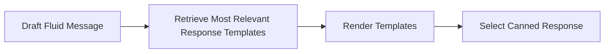

# Canned Responses

Canned responses는 Parlant 에이전트의 응답에 대한 정확한 제어를 제공합니다.

[Canned responses의 개념](https://en.wikipedia.org/wiki/Canned_response)은 실제 콜 센터에서 유래되었으며, 에이전트가 일관되고 정확하며 브랜드에 부합하는 방식으로 고객과 소통하도록 보장하기 위해 널리 사용됩니다.

사전 정의되고 사전 승인된 응답 세트로 제한함으로써, 에이전트가 일관된 톤, 스타일 및 정확성으로 소통하도록 보장하여 **미묘한 원하지 않는 출력이나 환각 출력의 위험을 완전히 제거하면서** 브랜드 음성 및 서비스 프로토콜과 완벽하게 일치하도록 합니다.

Canned responses는 카드 한 벌처럼 작동합니다: 에이전트에게 제공하는 선택지 세트가 주어지면, 대화 맥락을 기반으로 필요한 응답과 가장 잘 일치하는 가장 적절한 "카드"를 선택합니다.


## 실용적 예제

#### Canned Responses 없이
LLM 생성(토큰별) 응답 사용.

> **Customer:** 재고가 있나요?
>
> **Agent:** 네, 이 품목이 재고에 있습니다! 찾는 데 도움이 필요하면 알려주세요.

#### Canned Responses와 함께
```
# 초안 메시지: "네, 이 품목이 재고에 있습니다! 찾는 데 도움이 필요하면 알려주세요."
#
# 사용 가능한 템플릿:
# - ...
# - "안녕하세요, {{std.customer.name}}! 오늘 무엇을 도와드릴까요?"
# - ...
# - "아니요, 죄송합니다. 마지막 것들을 방금 판매했습니다. 비슷한 것을 보시겠습니까?"
# - "네, 있습니다. 장바구니에 추가해 드릴까요?"
# - ...
```
> **Customer:** 재고가 있나요?
>
> **Agent:** 네, 있습니다. 장바구니에 추가해 드릴까요?


## Canned Responses 작동 방식

내부적으로 canned responses는 4단계 프로세스로 작동합니다:

1. 에이전트는 현재 상황 인식(상호작용, 가이드라인, 툴 결과 등)을 기반으로 유동적인 메시지를 초안합니다
2. 엔진은 초안 메시지를 기반으로 가장 관련성 높은 canned response 템플릿을 검색합니다
3. 엔진은 해당하는 경우 툴 제공 필드 대체를 사용하여 후보 템플릿을 렌더링합니다
4. 초안 메시지를 기반으로 에이전트는 제공된 후보 중에서 가장 적합한 canned response를 선택합니다




## Composition Modes


Parlant 에이전트는 응답에서 여러 **composition modes** 중 하나를 사용할 수 있습니다. 이러한 composition modes는 에이전트 출력에 대한 다양한 수준의 제한과 canned responses를 사용하는 방식을 제공합니다.

| Mode | 설명 | 사용 사례 |
|------|-------------|-----------|
| **Fluid** | 에이전트는 좋은 매칭을 찾을 수 있으면 canned responses에서 선택하는 것을 우선시하지만, 그렇지 않으면 기본 메시지 생성으로 대체합니다. | **(A)** 대부분 유동적으로 유지하되 해당하는 경우 특정 상황과 응답 제어<br/>**(B)** 에이전트 프로토타이핑, 진행하면서 추가 발화에 대한 유동적 권장사항 생성 |
| **Composited** | 에이전트는 canned response 후보만 사용하여 생성된 초안 메시지를 검색된 후보의 스타일을 모방하도록 변경합니다 | 음성 톤을 유지하는 것이 중요한 브랜드 민감 사용 사례 |
| **Strict** | 에이전트는 제공된 응답에서만 출력할 수 있습니다. 일치하는 응답이 없으면 에이전트는 커스터마이징 가능한 no-match 메시지를 보냅니다. | 가장 미묘하고 드문 환각도 감당할 수 없는 고위험 설정 |

> **팁:**
> 고위험 사용 사례가 있고 GenAI 에이전트를 고객에게 배포하는 것에 대해 우려가 있다면, strict 모드로 시작하는 것을 권장합니다. Parlant는 유연하며 준비가 되면 더 유동적인 모드로 쉽게 전환할 수 있습니다. 모드 간 전환 시에도 대화 모델의 다른 모든 측면을 유지하고 활용할 수 있습니다.

### 에이전트의 Composition Mode 설정

에이전트를 생성할 때 올바른 `composition_mode`를 전달하기만 하면 됩니다:

```python
await server.create_agent(
    name="My Agent",
    description="An agent that uses canned responses",
    composition_mode=p.CompositionMode.STRICT,  # 또는 FLUID 또는 COMPOSITED
)
```


## Canned Responses 생성

에이전트를 위한 canned responses를 생성하는 방법은 다음과 같습니다:

```python
await agent.create_canned_response(template=TEXT)
```

#### Journey 범위 응답

**journey 범위** 응답을 추가할 수도 있습니다. 이는 특정 journey가 활성화된 경우에만 사용할 수 있는 응답입니다. Canned responses를 journeys로 범위를 지정하면 선택할 응답 세트를 좁혀 원하는 응답을 선택할 가능성이 높아집니다.

이를 위해 에이전트 대신 특정 journey 인스턴스에서 `create_canned_response` 메서드를 호출하면 됩니다:

```python
await journey.create_canned_response(template=TEXT)
```

#### Preamble 응답

Parlant는 [인지된 성능](https://en.wikipedia.org/wiki/Perceived_performance#:~:text=Perceived%20performance%2C%20in%20computer%20engineering%2C%20refers%20to%20how,The%20concept%20applies%20mainly%20to%20user%20acceptance%20aspects.) 원리를 활용하여 대화형 사용자 경험을 향상시키기 위해 여러 기술을 사용합니다. 이러한 기술 중 하나는 **preamble responses** 사용입니다.

Parlant 에이전트는 자세하고 정확한 응답을 생성하는 작업을 수행하는 동안 고객의 입력을 인정하기 위해 preamble responses(_"알겠습니다."_, _"이해했습니다."_, 또는 _"그것에 대해 살펴보겠습니다"_)를 보내는 경우가 많습니다.

일반적으로 이러한 preamble responses는 맥락에 따라 에이전트에 의해 자동으로 생성되지만, 에이전트가 선택할 수 있는 맞춤형 preamble responses를 생성할 수도 있습니다.

Canned preamble response를 생성하려면 canned response 생성에 `preamble()` 태그를 추가하면 됩니다:

```python
await agent.create_canned_response(
    template="Sure thing.",
    tags=[p.Tag.preamble()],
)
```

## 템플릿 구문

Canned responses는 **템플릿**을 사용하여 정의됩니다. 템플릿은 정적 텍스트뿐만 아니라 응답이 선택될 때 실제 값으로 대체될 동적 필드를 포함할 수 있는 문자열입니다.

### 표준 필드

표준 필드(`std.` 접두사 사용)를 사용하여 대화 맥락에서 동적 정보를 표시합니다:

#### 사용 가능한 값
1. `std.customer.name`: 문자열; 고객의 이름(미등록 [고객](https://parlant.io/docs/concepts/entities/customers)의 경우 `Guest`)
2. `std.agent.name`: 문자열; 에이전트의 이름
3. `std.variables.NAME`: 모든 타입; `NAME`이라는 변수의 내용
4. `std.missing_params`: 문자열 목록; [Tool Insights](https://parlant.io/docs/concepts/customization/tools#tool-insights-and-parameter-options)를 기반으로 누락된 툴 매개변수의 이름 포함(있는 경우)

#### 예제

```python
await agent.create_canned_response(
  template="Hi {{std.customer.name}}, Yes, this product is available in stock."
)
```

### Generative 필드
`generative.` 접두사가 있는 필드를 참조하면, LLM이 이름과 주변 맥락을 기반으로 값을 자동으로 추론하고 대체합니다. 이는 strict 템플릿에 제어되고 국소화된 생성을 도입하는 좋은 방법입니다.

#### 예제

```python
await agent.create_canned_response(
    template="Can I ask why you'd like to return {{generative.item_name}}?"
)
```

### 툴/Retriever 기반 필드

Canned responses는 툴 및 retriever 결과에서 오는 필드를 참조할 수 있습니다. 이러한 필드는 `ToolResult` 또는 `RetrieverResult`의 `canned_response_fields` 속성에 지정되어야 합니다.

이는 canned responses에 진정으로 동적 데이터를 도입할 수 있기 때문에 가장 유용한 필드 타입 중 하나입니다.

> **경고: 중대한 환각을 피하기 위한 필드의 중요한 역할**
>
> Canned responses에서 툴 기반 필드를 사용하는 또 다른 큰 이점이 있습니다. 후보 응답을 검색할 때, 엔진은 `canned_response_fields`도 살펴보며 관련성을 결정합니다.
>
> 맥락에 존재하지 않는 필드를 참조하는 응답은 초안 메시지와 유사하더라도 절대 선택되지 않습니다. 이는 에이전트가 생성한 응답이 사용 가능한 실제 데이터에 기반하도록 보장하는 데 도움이 되므로 중요합니다.
>
> 예를 들어, strict composition mode를 사용할 때, `successful_transaction` 필드가 성공적으로 실행된 툴 호출에 의해 제공되지 않았다면 에이전트는 `{{successful_transaction.id}}`를 참조하는 메시지를 절대 출력할 수 없습니다. 즉, 응답과 툴을 올바르게 조정하면 에이전트가 데이터나 상태에 대해 오해의 소지가 있는 응답을 환각하지 않도록 보장할 수 있습니다.

#### 예제

```python
@p.tool
def get_account_balance(context: p.ToolContext) -> p.ToolResult:
    balance = 1234.5

    return p.ToolResult(
        # `data` 필드에 결과를 제공해야 합니다.
        # 이는 가이드라인을 평가하고 툴을 호출하며
        # 초안 메시지를 생성할 때 에이전트에게 알리는 것입니다.
        data={f"Account balance is {balance}"},
        # 여기서는 템플릿 필드 대체를 위해 특별히 동적 값을 제공합니다
        canned_response_fields={"account_balance": balance},
    )
```

그리고 이것이 응답 템플릿이 이 필드를 참조하는 방법입니다:

```python
await agent.create_canned_response(template="Your current balance is {{account_balance}}")
```

## 툴에서 전체 응답 반환
툴은 고려를 위한 완전한 canned responses도 반환할 수 있습니다. 이는 필드 대체를 위한 데이터를 제공하는 것이 아니라 툴의 출력을 기반으로 완전한 응답을 생성하려는 경우에 유용합니다. 복잡한 Q&A 검색 시나리오에 특히 관련이 있는 경우가 많습니다.

```python
@p.tool
def get_answer(context: p.ToolContext, question: str) -> p.ToolResult:
    answer = "The answer to your question is...."

    return p.ToolResult(
        data=answer,
        # 답변을 완전한 canned response 후보로 제공
        canned_responses=[answer],
    )
```

## 응답 선택 최적화

에이전트가 올바른 canned response를 선택하도록 보장하는 방법을 살펴보겠습니다.

#### 초안 메시지 제어

선택 프로세스가 작동하는 방식 때문에, 올바른 응답이 전달되도록 하는 첫 번째 단계는 초안 메시지가 원하는 응답에 가능한 한 가깝게 생성되도록 보장하는 것입니다. 가이드라인, journeys, 툴, 용어집 용어 및 에이전트 설명과 같은 모든 표준 제어 메커니즘을 사용하여 이를 달성할 수 있습니다.

즉, 응답 선택 전에 어떤 초안이 생성되고 있는지 주의 깊게 살펴봐야 합니다. 통합 UI에서 생성된 초안 메시지를 검사하여 에이전트가 무엇을 말하고 싶어 하는지 확인할 수 있습니다.


#### 올바른 후보가 검색되도록 보장
다음으로, 원하는 응답 템플릿이 엔진에 의해 선택 후보로 검색되도록 보장해야 합니다.

때로는 응답 자체가 초안 메시지에 충분히 가까워 후보 목록에 나타납니다. 그러나 항상 그런 것은 아닙니다—특히 템플릿에 의미적 유사성 비교를 어렵게 만드는 필드 대체가 포함된 경우.

이를 위해 canned responses를 생성할 때 **signals**를 사용할 수 있습니다. Signals는 에이전트에게 "이 응답은 이러한 초안에 대한 좋은 매칭입니다"라고 말하는 방법입니다. 각 signal은 본질적으로 초안 메시지 예제입니다. 후보 응답을 검색할 때, 엔진은 관련성을 결정하기 위해 이러한 signals도 살펴보므로, 응답에 초안 메시지에 정말 가까운 signal이 있으면 응답 자체가 형식상 상당히 다르더라도 후보로 검색됩니다.

Canned responses에 signals를 추가하는 방법은 다음과 같습니다:
```python
await agent.create_canned_response(
    template="Yes, we've got this item in stock! Let me know if you need any help finding it.",
    signals=["We do have it in stock", "We do! Do you need help finding it?"],
)
```

## Jinja2의 유연성

응답 템플릿은 Jinja2 템플릿 엔진과 통합되어 더 동적인 형식 지정, 대체 필터 및 목록 처리를 가능하게 합니다. [Jinja2 문서 사이트](https://jinja.palletsprojects.com/en/stable/)에서 더 고급 구문을 배울 수 있습니다.

#### 예제

```python
@p.tool
def get_pizza_toppings(context: p.ToolContext) -> p.ToolResult:
    toppings = ['olives', 'peppers', 'onions']

    return p.ToolResult(
        data={f"Toppings are {toppings}"},
        canned_response_fields={"toppings": toppings},
    )
```

```python
await agent.create_canned_response(
    template="We have the following toppings \n- {{t}}"
)
```

## No-Match 응답

Strict composition mode를 사용할 때, 에이전트가 초안에 대한 적절한 canned response를 찾을 수 없으면 no-match 응답을 보냅니다.

이 응답을 커스터마이징하려면 두 가지 방법이 있습니다:

1. 정적 no-match 응답 커스터마이징
2. 맥락에 따라 응답을 동적으로 생성하는 맞춤형 no-match 공급자 사용

#### 정적 No-Match 응답
이는 no-match 응답을 커스터마이징하는 가장 간단한 방법입니다. 에이전트가 적절한 canned response를 찾을 수 없을 때마다 사용될 정적 no-match 응답을 설정할 수 있습니다.

```python
async def initialize_func(c: p.Container) -> None:
    no_match_provider = c[p.BasicNoMatchResponseProvider]
    no_match_provider.template = "My custom no-match response."

async with p.Server(
    initialize_container=initialize_func,
) as server:
        ...
```

#### 맞춤형 No-Match 공급자
더 많은 유연성이 필요한 경우, 맞춤형 no-match 응답 공급자를 생성할 수 있습니다. 이를 통해 대화 맥락을 기반으로 no-match 응답을 동적으로 생성할 수 있습니다.

그러나 `p.LoadedContext`(내부 엔진 상태에 액세스할 수 있는)는 향후 릴리스에서 변경될 수 있으므로, 언젠가 구현을 조정해야 할 수도 있다는 점을 명심하세요.

```python
class CustomNoMatchResponseProvider(p.NoMatchResponseProvider):
    async def get_template(self, context: p.LoadedContext, draft: str | None) -> str:
        # 대화 기록, 초안 메시지, 가이드라인, 툴 호출 등과 같은
        # 제공된 맥락을 기반으로 맞춤형 no-match 응답 생성
        template = "..."

        return template

async def configure_func(c: p.Container) -> p.Container:
    c[p.NoMatchResponseProvider] = CustomNoMatchResponseProvider()

async with p.Server(
    configure_container=configure_func,
) as server:
        ...
```
