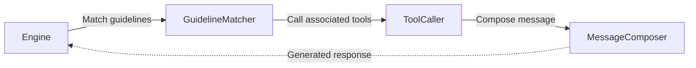
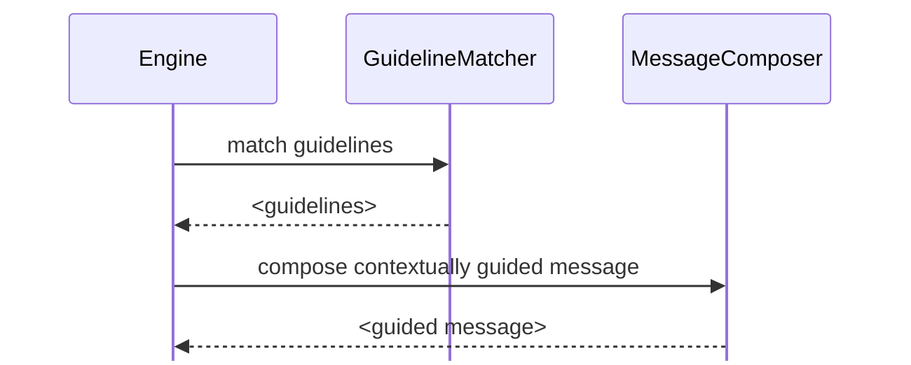

# Guidelines

가이드라인은 강력한 커스터마이제이션 기능입니다. 원칙적으로는 매우 간단하지만, 이에 대해 할 이야기가 많습니다.

### 가이드라인이란?
가이드라인은 Parlant에서 [에이전트](https://parlant.io/docs/concepts/entities/agents)의 행동을 맥락적이고 타겟팅된 방식으로 조정하는 주요 방법입니다.

이를 통해 에이전트가 특정 상황에서 어떻게 응답해야 하는지 지시하고, 기본 행동을 재정의하여 행동이 기대와 비즈니스 요구에 부합하도록 보장할 수 있습니다.

가이드라인을 통해 [에이전트](https://parlant.io/docs/concepts/entities/agents)의 행동을 두 가지 주요 시나리오에서 형성할 수 있습니다:
 1. 특정 기본 응답이 기대에 부합하지 않을 때
 1. 모든 상호작용에서 일관된 행동을 보장하고 싶을 때

> **가이드라인 vs. Journeys**
>
> Journeys는 구조화된 단계별 상호작용 흐름을 제공하는 이상적인 방법이며, 가이드라인은 에이전트의 행동에 맥락적 조정을 제공하는 것에 더 중점을 둡니다. 복잡한 상호작용에는 journeys를, 더 간단한 맥락별 조정에는 가이드라인을 사용하세요—또한 특정 journey 내에 있지 않은 간단하고 일반적인 툴 호출 트리거에도 사용하세요.

#### 예제
고객이 제품을 주문하는 데 도움을 주는 에이전트가 있다고 가정해보겠습니다. 기본적으로 에이전트의 행동은 다음과 같을 수 있습니다:
> **User:** 새 노트북을 주문하고 싶습니다.
>
> **Agent:** 좋습니다. 선호 사항이 무엇인가요? (예: 예산, 운영 체제, 화면 크기, 사용 사례?)

하지만 먼저 Mac을 원하는지 Windows를 원하는지 간단히 물어보는 것으로 에이전트를 더 친근하게 만들고 싶다고 가정해봅시다. 다음과 같이 가이드라인을 추가하여 이것이 일관되게 발생하도록 보장할 수 있습니다:

```python
await agent.create_guideline(
    condition="The customer wants to buy a laptop",
    action="First, determine whether they prefer Mac or Windows"
)
```

다음과 같은 대화가 결과로 나타납니다:

> **User:** 새 노트북을 주문하고 싶습니다.
>
> **Agent:** 좋습니다. Mac을 선호하시나요, 아니면 Windows를 선호하시나요?

> **원하는 것을 조심하세요**
>
> LLM에게 지시하는 것은 인간에게 지시하는 것과 매우 유사합니다. 단, 기본적으로 누가 지시하는지와 지시가 주어지는 맥락에 대한 맥락이 전혀 없다는 점이 다릅니다. 이러한 이유로 가이드라인을 제공할 때, 에이전트가 모호함 없이 따를 수 있도록 가능한 한 명확하고 명료하게 노력해야 합니다. 이에 대해서는 이 페이지 후반부에서 더 자세히 다룹니다.

### 가이드라인의 구조
Parlant에서 각 가이드라인은 두 부분으로 구성됩니다: **condition**과 **action**.

1. **action** 부분은 가이드라인이 달성해야 하는 것을 설명합니다. 예를 들어, "할인 제공."
1. **condition**은 _액션이 발생해야 하는 시기_를 지정하는 부분입니다. 예를 들어, "휴일인 경우".

```python
await agent.create_guideline(
    condition="It is a holiday",
    action="Offer a discount on the order"
)
```

가이드라인에 대해 비공식적으로 말할 때, _when/then_ 형식으로 설명하는 경우가 많습니다: When <CONDITION>, Then <ACTION>, 또는 이 경우 휴일일 때, 할인을 제공합니다.

> **가이드라인 추적**
>
> 세션에서 액션이 완료되면, Parlant는 가이드라인을 비활성화합니다—맥락적 변화로 인해 액션이 다시 적용되어야 한다고 믿을 이유가 없는 한(예: 위의 예에서 고객이 다른 주문을 시작하는 경우).

### 툴 사용하기

대부분의 LLM의 가장 큰 문제 중 하나는 거짓 양성에 대한 편향입니다. 간단히 말해, 항상 기쁘게 하려고 하기 때문에 대부분의 질문에 긍정적으로 답변하는 경향이 있습니다.

이는 에이전트가 올바른 맥락이나 정보가 있을 때만 특정 액션을 수행하도록 보장하고 싶을 때 큰 문제가 됩니다.

이러한 이유로 Parlant를 사용하면 [툴](https://parlant.io/docs/concepts/customization/tools)(본질적으로 함수)을 가이드라인과 연결할 수 있으며, 에이전트는 상호작용의 현재 맥락 내에서 가이드라인의 필수 조건이 충족될 때만 툴 호출을 고려합니다.

마찬가지로 중요한 것은, 특정 상황이 유지될 때 특정 툴을 *어떻게* 그리고 *왜* 호출하고 싶은지에 대한 맥락 정보를 지정할 수 있다는 것입니다. 다음은 예입니다:

```python
@p.tool
async def find_products_in_stock(context: p.ToolContext, query: str) -> p.ToolResult:
  ...

await agent.create_guideline(
    condition="The customer asks about the newest laptops",
    action="First recommend the latest Mac laptops",
    # 가이드라인의 액션은 다음 툴이 올바른 쿼리로 호출되도록 보장합니다
    # (예: "최신 Mac 노트북")
    tools=[find_products_in_stock],
)
```


## 가이드라인 작동 방식

가이드라인이 어떻게 작동하는지 이해하려면 Parlant의 응답 처리 파이프라인을 간략히 살펴봐야 합니다.

에이전트가 메시지를 받으면, 응답이 가이드라인과 기대에 부합하도록 보장하기 위해 여러 단계를 포함하는 응답 처리 파이프라인을 거칩니다.



위 그림이 시사하듯이, 가이드라인은 에이전트가 응답을 구성하기 *전에* 평가되고 매칭됩니다.

> **명심하세요**
>
> 이는 에이전트가 응답을 생성하기 *전에* 상호작용의 맥락을 기반으로 지시와 툴 호출을 평가하고 적용할 수 있어야 함을 의미합니다. 즉, "Y를 수행한 직후에 X를 수행하세요"와 같은 가이드라인은 예상대로 작동하지 않을 수 있습니다.

### Parlant가 가이드라인을 사용하는 방법
LLM은 텍스트의 [통계적 주의](https://arxiv.org/abs/1706.03762) 원리에 기반한 훌륭한 창조물이지만, 그들의 주의 범위는 고통스럽게 유한합니다. 지시를 따르는 것에 관해서는 도움이 필요합니다.

뒤에서 Parlant는 각 시점에서 관련 가이드라인만 포함하도록 LLM의 맥락을 동적으로 관리함으로써 에이전트 응답이 기대와 일치하도록 보장합니다.



각 응답 전에 Parlant는 대화의 현재 상태와 관련된 가이드라인만 로드합니다. 이러한 동적 관리는 LLM의 "인지 부하"를 최소화하여 주의를 극대화하고, 결과적으로 각 응답이 예상 행동과 일치하도록 합니다.

> Parlant가 [고객](https://parlant.io/docs/concepts/entities/customers)에게 도달하기 전에 에이전트의 출력을 감독하여 가이드라인이 올바르게 준수되었는지를 최대한 보장하는 또 다른 중요한 능력도 사용합니다. 이를 달성하기 위해, Parlant에서 작업하는 NLP 연구원들은 **Attentive Reasoning Queries (ARQs)**라는 혁신적인 프롬프팅 기법을 고안했습니다. [arxiv.org, Attentive Reasoning Queries: A Systematic Method for Optimizing Instruction-Following in Large Language Models](https://arxiv.org/abs/2503.03669#:~:text=We%20present%20Attentive%20Reasoning%20Queries%20%28ARQs%29%2C%20a%20novel,in%20Large%20Language%20Models%20through%20domain-specialized%20reasoning%20blueprints.)에서 연구 논문을 자유롭게 탐색할 수 있습니다.

### 가이드라인 관리
Parlant는 가이드라인 관리를 가능한 한 간단하게 만들도록 구축되었습니다.

종종 가이드라인은 비즈니스 전문가가 에이전트의 행동 변경을 요청할 때 추가됩니다. 개발자는 Parlant를 사용하여 이러한 변경을 신속하고 안정적으로 수행할 수 있으며, 함께 작업하는 비즈니스 전문가의 속도에 맞춰 반복할 수 있습니다.

다음은 실용적인 예입니다. 영업팀이 요청할 때: "에이전트는 솔루션에 대해 논의하기 전에 먼저 고객의 요구와 문제점에 대해 물어봐야 합니다," 이 피드백을 구현하는 데 다음을 추가하여 1분이면 됩니다:

```python
await agent.create_guideline(
  condition="The customer has yet to specify their current pain points",
  action="Seek to understand their pain points before talking about our solution"
)
```

추가되면 Parlant가 나머지를 처리하여, 이 새 가이드라인이 모든 관련 대화에서 일관되게 따라지도록 자동으로 보장하며, 다른 가이드라인에 대한 에이전트의 준수를 저하시키지 않습니다.

### 가이드라인 작성하기

LLM을 귀하의 비즈니스에 막 들어온 매우 박식한 낯선 사람으로 생각하세요. 수년간의 일반적인 경험이 있을 수 있지만, 귀하의 특정 맥락, 선호도 또는 일하는 방식을 모릅니다. 그러나 이 낯선 사람은 도움을 주고 싶어 하며 불확실할 때도 항상 시도할 것입니다.

여기서 가이드라인이 등장합니다. 이 끝없는 열정과 광범위한 지식을 귀하의 사용 사례에 집중되고 적절한 응답으로 채널링하는 방법입니다.

그러나 효과적인 가이드라인을 지정하는 것은 약간의 예술입니다—사람들과 마찬가지로.

#### 가이던스의 예술

고객 서비스 시나리오를 고려하세요. 매우 순진한 예로, 다음과 같이 유혹받을 수 있습니다:

**하지 마세요**
> * **Condition:** 고객이 불행함
> * **Action:** 기분을 좋게 만들기

의도는 좋지만, 이는 너무 모호한 가이드라인의 예입니다. LLM은 이를 무수히 많은 방식으로 해석할 수 있습니다. 실제로 제공할 수 없는 할인을 제공하는 것부터 귀하의 브랜드에 부적절할 수 있는 농담을 하는 것까지. 대신 다음을 고려하세요:

**하세요**
> * **Condition:** 고객이 우리 서비스에 대한 불만을 표현함
> * **Action:** 특히 그들의 좌절을 인정하고, 진심 어린 공감을 표현하며, 적절하게 해결할 수 있도록 경험에 대한 세부 정보를 요청합니다.

이 가이드라인이 어떻게 구체적이고 제한적인지 주목하세요.

**하지 마세요**
> * **Condition:** 고객이 제품에 대해 문의함
> * **Action:** 그들이 좋아할 만한 것을 추천

**하세요**
> * **Condition:** 고객이 선호도를 지정하지 않고 제품 추천을 요청함
> * **Action:** 추천하기 전에 그들의 특정 요구, 유사한 제품에 대한 이전 경험, 찾고 있는 특정 기능에 대해 물어보세요

#### 적절한 균형 찾기

원칙적으로 우리는 "딱 맞는" 가이드라인을 찾고 있습니다—과도하게 또는 과소하게 지정되지 않은. 기술 지원 에이전트에 대한 이러한 반복을 고려하세요:

**하지 마세요**

너무 모호함:
> * **Condition:** 고객에게 기술적 문제가 있음
> * **Action:** 문제를 해결하도록 도움

**하지 마세요**

너무 경직됨:
> * **Condition:** 고객이 오류 메시지를 보고함
> * **Action:** 먼저 운영 체제 버전을 묻고, 그다음 브라우저 버전을 묻고, 그다음 마지막 시스템 업데이트 날짜를 묻습니다

**하세요**

딱 맞음:
> * **Condition:** 고객이 플랫폼 액세스에 어려움을 보고함
> * **Action:** 상황을 이해한다고 표현하고, 설정에 대한 주요 세부 정보(OS 및 브라우저)를 요청하며, 구체적인 문제 해결 단계를 시도했는지 확인합니다

LLM은 일반적으로 귀하의 가이던스를 꽤 문자 그대로 받아들입니다. 에이전트에게 "항상 프리미엄 기능을 제안하세요"라고 말하면, 가격에 대해 불평하는 고객과 이야기할 때도 그렇게 할 수 있습니다. 가이드라인을 작성할 때 항상 더 넓은 맥락과 잠재적 엣지 케이스를 고려하려고 노력하세요. 이는 변경과 문제 해결을 줄이는 데 도움이 될 것입니다.

**의심스러울 때는 모호함 쪽으로 치우치는 것을 선호하세요.** Agentic Behavior Modeling의 목표는 모든 가능한 상호작용을 스크립팅하는 것이 아니라, LLM의 자연스러운 일반화 능력을 귀하의 특정 사용 사례에 대한 신뢰할 수 있고 적절한 응답으로 형성하는 명확하고 맥락적인 가이던스를 제공하는 것입니다.
