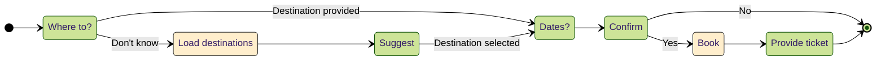
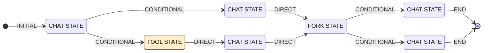
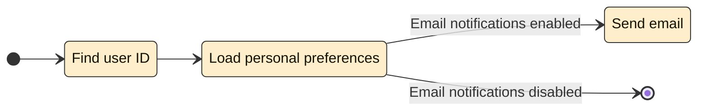
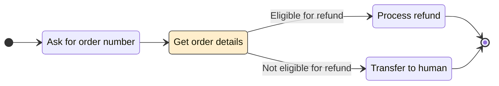
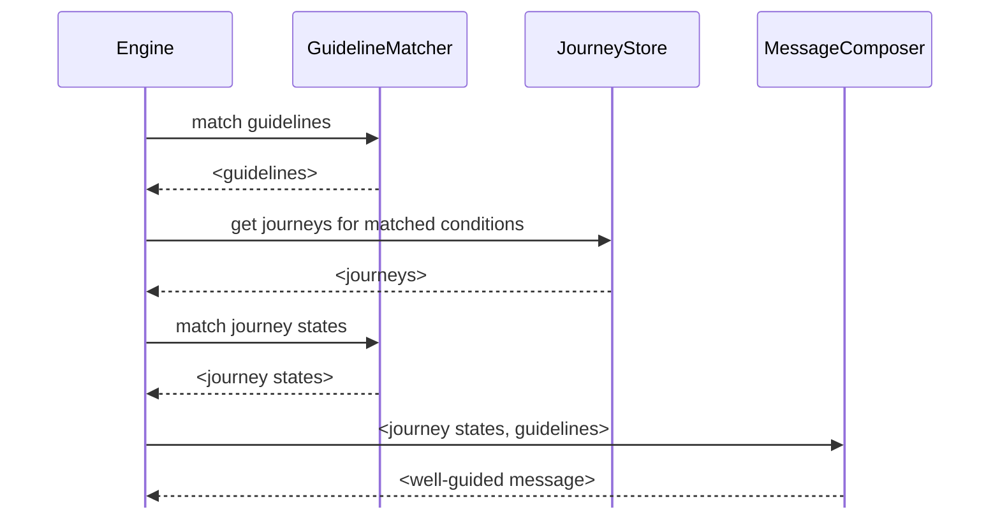

# Journeys

여행 예약, 문제 해결, 또는 다른 방식으로 사용자를 의도한 방식으로 대화 프로세스를 통해 안내하는 등 에이전트가 특정 대화 흐름을 따르도록 하고 싶은 많은 사용 사례가 있습니다.

Parlant에서는 **Journeys**를 사용하여 이를 쉽고 안정적으로 달성할 수 있습니다.

#### Journey 구조

Journeys에는 4가지 중요한 구성 요소가 있습니다:
1. **Title:** Journey를 다른 journeys와 구별하기 위한 짧고 설명적인 이름입니다.
1. **Conditions:** 이러한 맥락적 쿼리는 journey가 언제 활성화되어야 하는지를 결정합니다.
1. **Description:** Journey의 특성을 설명하며, 필요한 경우 동기부여 또는 방향 설정 메모를 포함합니다.
1. **States & Transitions**: 에이전트에게 이상적인 흐름이 무엇인지를 전달하는 상태 다이어그램입니다.

> **경직성 vs. 유연성 균형**
>
> 전통적인 대화 프레임워크에서는 흐름이 경직되게 정의되며, 각 상태와 전환이 문자 그대로 엄격하게 따라집니다.
>
> 이러한 유형의 접근 방식은 추론하고 구현하기 쉽지만, 에이전트가 고객의 상호작용 패턴에 적응할 수 없을 때 매우 자주 좌절스러운 사용자 경험으로 이어집니다. 이러한 "만능형" 접근 방식은 인간 대화의 미묘함을 고려하지 않아 사용자 이탈과 불만족으로 이어지고, 궁극적으로 사용되지 않는 에이전트가 됩니다.
>
> Parlant는 "학습된 교훈" 접근 방식을 구현하여 에이전트가 보다 자연스러운 방식으로 journey의 상태를 탐색할 수 있도록 합니다. 상태를 건너뛰거나, 이전 상태를 재방문하거나, 적응적인 방식으로 나중 상태로 앞으로 이동하도록 선택할 수 있습니다.
>
> 따라서 journeys는 경직되게 따라야 하는 것이 아니라 에이전트를 위한 안내 프레임워크 역할을 합니다. 에이전트는 고객의 상호작용 패턴에 대한 적응적 접근 방식을 유지하면서 가능한 한 엄격하게 흐름을 따르려고 노력할 것입니다.

## 실습 예제

여행사 에이전트의 journey에 대한 다음 예를 고려하세요:
> * **Title:** 항공편 예약
> * **Conditions:** 고객이 항공편 예약을 요청함
> * **Description:** 이 journey는 고객을 항공편 예약 프로세스를 통해 안내합니다.



이 journey는 고객이 항공편 예약을 요청할 때 활성화됩니다. 에이전트는 고객의 속도에 맞춰 적응적 접근 방식을 유지하면서 흐름을 따르려고 노력하지만, 모든 필요한 정보가 수집되도록 보장합니다.

#### Journey 구현하기
Journeys가 어떻게 작동하는지 더 알아보기 전에, 위의 journey를 어떻게 구현하는지 살펴보겠습니다:

```python
async def create_book_flight_journey(agent: p.Agent):
    journey = await agent.create_journey(
        title="Book Flight",
        conditions=["The customer requested to book a flight"],
        description="This journey guides the customer through the flight booking process.",
    )

    t1 = await journey.initial_state.transition_to(chat_state="Ask if they have a destination in mind")

    #  고객의 응답에 따라 분기
    t2 = await t1.target.transition_to(condition="They do", chat_state="Get dates of travel")

    t3a = await t1.target.transition_to(condition="They don't", tool_state=load_popular_destinations)
    t3b = await t3a.target.transition_to(chat_state="Recommend a destination")

    # 목적지를 선택한 후 메인 경로로 다시 병합합니다.
    # 이는 기존 상태 노드로 전환하여 수행됩니다.
    await t3b.target.transition_to(state=t2.target, condition="Destination selected")

    t4 = await t2.target.transition_to(chat_state="Confirm details")

    t5a = await t4.target.transition_to(tool_state=book_flight)
    t5b = await t5a.target.transition_to(chat_state="Provide ticket details")
```

## 상태와 전환
Journey는 상태 다이어그램을 모델로 하며, 이는 각 노드가 **상태**를 나타내고 각 엣지가 **전환**(조건과 연결될 수 있음)을 나타내는 방향 그래프입니다.



#### 상태
1. **Chat States:** 이 상태에 있는 동안 에이전트는 상태의 액션에 의해 안내되면서 고객과 대화합니다. 에이전트는 다른 상태로 전환하기로 결정할 때까지 이 상태에서 여러 턴을 보낼 수 있습니다.
```python
t = await state.transition_to(chat_state=CONVERSATIONAL_INSTRUCTION)
```
2. **Tool States:** 이 상태에서 에이전트는 외부 툴을 호출하여 작업을 수행하고 그 결과를 맥락에 로드합니다. Tool state 다음에는 반드시 chat state가 와야 하며, 일반적으로 툴의 결과를 고객에게 제시하는 데 사용됩니다.
```python
t = await state.transition_to(tool_state=TOOL)
```
```python
t = await state.transition_to(tool_state=TOOL, tool_instruction=OPTIONAL_HINT_ON_HOW_TO_USE_TOOL)
```

> **Tool에서 Chat으로의 전환**
>
> Tool state에서 chat state로 전환할 때, 에이전트는 자동으로 툴의 결과를 맥락에 로드하므로 chat state의 액션에서 사용할 수 있습니다. Tool state는 다른 tool state로 전환할 수 없으며, 항상 chat state가 뒤따라야 합니다.
>
> 이는 의도적인 설계입니다. 툴 사용은 에이전틱 애플리케이션에서 눈에 띄는 지연 시간을 발생시킬 수 있기 때문입니다. 순차적 tool states를 사용하는 대신, 모든 필요한 작업을 수행하는 단일 tool state를 사용한 다음 chat state로 이어 고객에게 결과를 제시해야 합니다.

#### 전환
1. **Direct Transitions:** 이러한 전환은 항상 취해져야 합니다. 분기 없이 대화를 앞으로 이동시킵니다.
2. **Conditional Transitions:** 이러한 전환은 연결된 조건이 충족될 때/때만 취해집니다.
```python
t = await state.transition_to(chat_state=CONVERSATIONAL_INSTRUCTION, condition=CONDITION)
```
```python
t = await state.transition_to(tool_state=TOOL, condition=CONDITION)
```

대부분의 경우, `chat_state` 또는 `tool_state` 인수를 받는 `transition_to()` 오버로드를 사용하며, 이는 전환의 대상 상태를 자동으로 생성합니다. 그러나 `state` 인수를 받는 `transition_to()` 오버로드를 사용할 수도 있으며, 이를 통해 journey의 기존 상태 노드로 전환할 수 있습니다.

```python
t = await state.transition_to(state=EXISTING_STATE)
```
```python
t = await state.transition_to(state=EXISTING_STATE, condition=CONDITION)
```

> **조건부 전환과 직접 전환 결합**
>
> 상태가 다른 상태로의 조건부 전환을 가지고 있는 경우, 직접 전환도 가질 수 없습니다. 조건이 충족될 때 엔진이 어떤 전환을 취할지 논리적으로 결정할 수 없기 때문입니다. SDK는 이 규칙을 강제합니다.

#### Fork States
Journeys는 **fork state**라는 특수한 종류의 상태도 지원합니다.

이 상태에서 에이전트는 조건을 평가하고 그에 따라 대화 흐름을 분기합니다. 엄밀히 말하면, 이러한 분기는 fork states 없이도 모델링할 수 있지만, 때로는 대화 흐름을 명확하고 명시적이며 조직화된 상태로 유지하는 데 유용한 모델링 도구입니다.

```python
fork = await state.fork()

t1 = await fork.transition_to(chat_state=CONVERSATIONAL_INSTRUCTION, condition=CONDITION_1)
t2 = await fork.transition_to(chat_state=CONVERSATIONAL_INSTRUCTION, condition=CONDITION_2)
t3 = await fork.transition_to(tool_state=TOOL, condition=CONDITION_3)
```

> **Journey 시각화**
>
> 코드로 상태 다이어그램을 구축하는 것은 때때로 약간 혼란스러울 수 있습니다. 구축하면서 journey를 시각화하여 흐름이 명확하고 논리적이며 의도한 대로인지 확인하는 것이 유용합니다. 방법은 다음과 같습니다:
>
> 1. 브라우저에서 `http://localhost:8800/journeys`를 방문하세요.
> 2. 시각화하려는 journey의 ID를 복사하세요.
> 3. 브라우저에서 `http://localhost:8800/journeys/<JOURNEY_ID>/mermaid`를 방문하세요. `<JOURNEY_ID>`를 복사한 ID로 바꾸세요.
> 4. 생성된 Mermaid 다이어그램 코드를 복사하세요.
> 5. [Mermaid live editor](https://mermaid.live/)에 붙여넣어 journey를 시각화하세요.

## Journey vs. 작업 자동화
엔진이 journeys와 어떻게 작동하는지 살펴보면, journeys는 모델에게 작업을 자동화하는 방법을 안내하는 데 사용되어서는 안 된다는 것을 의미합니다. 대신, journeys는 에이전트가 자신을 방향 설정하고 선호도에 따라 대화 흐름을 안내하는 데 사용됩니다.

이는 **비즈니스 로직**을 **대화 로직**과 분리하는 것의 중요성을 상기시키는 좋은 시기입니다. 전자는 맞춤형 [전용 툴](https://parlant.io/docs/concepts/customization/tools)(내부적으로 LLM을 사용할 수도 있고 사용하지 않을 수도 있음)로 가장 잘 처리되며, 후자는 대화 엔진으로 가장 잘 처리됩니다.

#### 해야 할 것과 하지 말아야 할 것

**하지 마세요**

다음은 ***유효한*** journey가 아닙니다. 대화 흐름이 아니라 작업 자동화 흐름을 나타내기 때문입니다.



**하세요**

다음은 유효한 journey입니다. 고객을 프로세스를 통해 안내하는 대화 프로토콜을 나타내기 때문입니다.



## 맥락 관리

LLM은 텍스트의 [통계적 주의](https://arxiv.org/abs/1706.03762) 원리에 기반한 훌륭한 창조물이지만, 그들의 주의 범위는 고통스럽게 유한합니다. 지시를 따르는 것에 관해서는 도움이 필요합니다.

뒤에서 Parlant는 각 시점에서 관련 journeys만 포함하도록 LLM의 맥락을 동적으로 관리함으로써 에이전트 응답이 기대와 일치하도록 보장합니다.

이는 `GuidelineMatcher`를 사용하여 수행되며, 본질적으로 현재 대화 맥락을 관련 journeys의 조건과 매칭합니다—이는 뒤에서 기본적으로 관찰적(실행 불가능한) 가이드라인입니다.



각 응답 전에 Parlant는 대화의 현재 상태와 관련된 가이드라인과 journeys만 로드합니다. 이러한 동적 관리는 LLM의 "인지 부하"를 최소화하여 주의를 극대화하고, 결과적으로 각 응답이 예상 행동과 일치하도록 합니다.

> **지연 시간 최적화**
>
> 이러한 왕복 접근 방식은 응답 지연 시간을 최소화하는 최적화된 알고리즘으로 구현됩니다.
>
> 엔진은 먼저 현재 대화 맥락을 기반으로 활성화될 journeys를 예측하려고 시도합니다. 이 예측을 고려하여, 가이드라인 매칭과 병렬로 관련 journeys의 상태를 매칭하려고 시도하여 응답 지연 시간에서 몇 초를 절약합니다.
>
> 이 예측이 실패할 때만(즉, 다른 journeys가 활성화된 경우) 추가 단계를 거쳐 그들의 상태도 매칭합니다.

## Journey 범위 가이드라인

Journey 범위 [가이드라인](https://parlant.io/docs/concepts/customization/guidelines)을 추가할 수 있으며, 이는 종속 journeys도 활성화된 경우에만 활성화될 수 있습니다. 다른 모든 때에는 이러한 가이드라인이 무시됩니다.

Journey 범위 가이드라인을 사용하는 것은 의도적인 방식으로 journey의 주요 흐름에서 이탈을 처리하는 권장 방법입니다. 또한 특정 가이드라인이 의도된 맥락에서만 평가되고 활성화되도록 보장하여 깨끗하고 조직화된 대화 모델을 유지하는 데 도움이 됩니다.

> **지시 우선순위**
>
> 일반적으로 Parlant 에이전트는 journey states보다 가이드라인에 더 많은 가중치를 부여합니다. 가이드라인은 더 구체적인 행동 재정의로 취급되기 때문입니다. 즉, 가이드라인이 매칭되면 활성 journey states보다 우선하는 경향이 있습니다.

```python
@p.tool
async def transfer_to_human_agent(context: p.ToolContext) -> p.ToolResult:
    ...

guideline = await journey.create_guideline(
    condition="the customer says they're unable to pay"
    action="connect them with a human agent",
    tools=[transfer_to_human_agent],
),
```

> **더 알아보기**
>
> 가이드라인에 대해 자세히 알아보려면 [Guidelines](https://parlant.io/docs/concepts/customization/guidelines) 페이지를 확인하세요.

## Journey 범위 Canned Responses
Journeys에 canned responses를 첨부하여 종속 journeys가 활성화된 경우에만 고려되도록 범위를 지정할 수도 있습니다.

```python
await journey.create_canned_response(
    template="What destination are you interested in?",
)

await journey.create_canned_response(
    template="I'm sorry, but I can't assist with that right now. Shall we go on with booking your flight?",
)
```

#### State 범위 Canned Responses
Journey 내의 특정 상태와 특정 canned responses를 연결할 수도 있습니다.

State 범위 canned responses에는 두 가지 모드가 있습니다: **명시적 고려**와 **독점적 고려**.

1. **명시적 고려:** 이 모드에서 에이전트는 해당 상태에 있을 때 연결된 응답이 항상 선택을 위해 고려되도록 보장합니다. 이는 `journey` 또는 `agent` 객체 아래에 canned response를 생성하여 수행됩니다.
```python
await state.transition_to(
    chat_state="Ask if they have a destination in mind",
    canned_responses=[
        await journey.create_canned_response(
            template="What destination are you interested in?",
        ),
    ],
)
```
2. **독점적 고려:** 이 모드에서 에이전트는 해당 상태에 있을 때만 연결된 응답을 고려합니다. 다른 때에는 이러한 응답을 사용하지 않습니다. 이는 `server` 객체 아래에 canned response를 생성하여 수행됩니다.

```python
await state.transition_to(
    chat_state="Ask if they have a destination in mind",
    canned_responses=[
        await server.create_canned_response(
            template="What destination are you interested in?",
        ),
    ],
)
```

> **더 알아보기**
>
> Canned responses에 대해 자세히 알아보려면 [Canned Responses](https://parlant.io/docs/concepts/customization/canned-responses) 페이지를 확인하세요.
