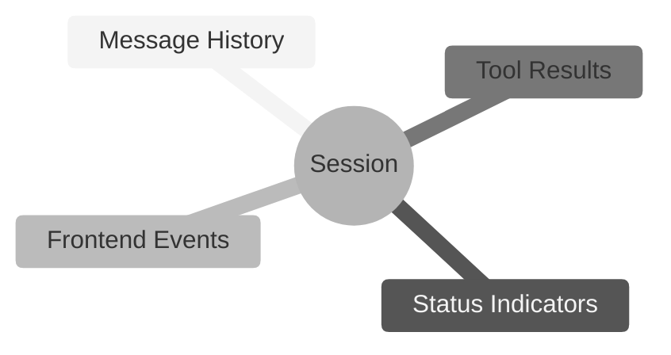
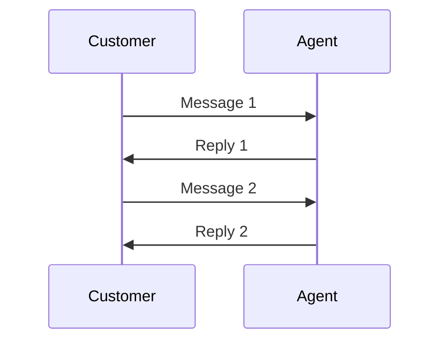
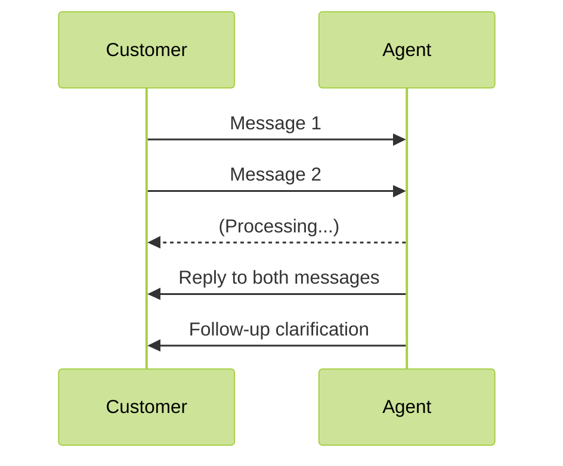
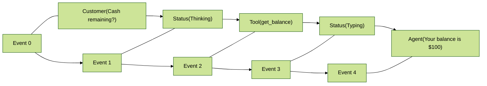
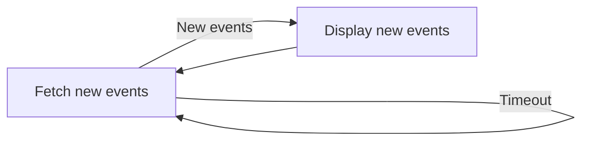

# Sessions

Session은 [agent](https://parlant.io/docs/concepts/entities/agents)와 [customer](https://parlant.io/docs/concepts/entities/customers) 간의 연속적인 상호작용을 나타냅니다.

Session은 대화 모델의 무대로, agent가 구조화되고 지속적인 방식으로 customer와 소통할 수 있게 합니다. 메시지, 상태 업데이트, 프론트엔드 이벤트 및 tool 호출 결과를 포함하여 agent와 customer 간에 발생하는 모든 상호작용을 캡슐화합니다.



> **Agent 메모리?**
>
> 일부 프레임워크가 "메모리"라고 부르는 것은 이미 Parlant의 session에 내장되어 있습니다. Agent는 session에서 발생한 모든 것을 지속적으로 인식하며, 이 정보를 사용하여 올바른 지침을 적용하고 적절한 응답을 생성합니다.

## 현대적인 상호작용 모델

Parlant는 대부분의 대화형 AI 프레임워크와 다른 방식으로 상호작용 session을 바라봅니다.

지난 수십 년 동안 거의 모든 형태의 대화형 AI는 customer가 메시지를 보내고 agent가 응답하는 턴 기반 상호작용을 가정했습니다.

그러나 이것은 실제 대화가 작동하는 방식이 아닙니다. 사람들은 종종 생각을 전달하기 위해 여러 개의 연속된 메시지를 보냅니다. 또한 agent는 무언가를 말하고 잠시 customer를 대기시킨 다음 후속 메시지와 함께 대화로 돌아올 수 있습니다.

**경직된 상호작용 모델**



**현대적인 상호작용 모델**



이것이 실제 대화가 작동하는 방식이므로 Parlant는 처음부터 이를 기본적으로 지원합니다.

> **다중 참여자 Session**
>
> Parlant의 개발 로드맵에서 요청된 기능으로, 여러 agent가 customer와 상호작용하거나 서로 상호작용할 수 있게 합니다. 이에 대한 또 다른 사용 사례는 customer를 다른 AI agent로 전환하는 것입니다.

## Session 저장소 구성

Session을 저장할 위치를 선택할 수 있습니다.

기본적으로 Parlant는 session을 유지하지 않으므로 메모리에 저장되고 서버가 재시작되면 손실됩니다. 이것은 테스트 및 개발 목적에 유용합니다.

Session을 유지하려면 선택한 데이터베이스를 사용하도록 Parlant를 구성할 수 있습니다. 로컬 지속성을 위해 통합 JSON 파일 저장소를 사용하는 것이 좋습니다. 설정이 전혀 필요하지 않기 때문입니다. 프로덕션 사용을 위해서는 기본 제공되는 MongoDB 또는 다른 데이터베이스를 사용할 수 있습니다.

### 로컬 저장소에 유지

이것은 session을 `$PARLANT_HOME/sessions.json`에 저장합니다.

```python
import asyncio
import parlant.sdk as p

async def main():
    async with p.Server(session_store="local") as server:
        # ...

asyncio.run(main())
```

### MongoDB에 유지

서버를 시작할 때 MongoDB 데이터베이스에 대한 연결 문자열을 지정하기만 하면 됩니다:

```python
import asyncio
import parlant.sdk as p

async def main():
    async with p.Server(session_store="mongodb://path.to.your.host:27017") as server:
        # ...

asyncio.run(main())
```

## 이벤트 기반 커뮤니케이션

Parlant의 session을 대화에서 발생한 모든 것의 타임라인으로 생각하세요.

이 타임라인의 각 순간(누군가 말하기, 상태 업데이트 또는 tool 호출 결과)은 이벤트로 캡처됩니다. 이러한 이벤트는 차례대로 줄을 서며, 각각 고유한 위치 번호(_offset_이라고 함)를 가지며 0부터 시작합니다.

대화가 전개되면 일련의 이벤트가 생성됩니다. Customer가 _"Hello"_라고 말하여 session을 시작할 수 있습니다. 그것이 이벤트 0입니다. 그런 다음 시스템은 agent가 메시지를 확인하고 응답을 준비하고 있음을 상태 이벤트를 출력하여 기록합니다. 그것이 이벤트 1입니다. Agent의 _"Hi there!"_는 이벤트 2가 되고, 기타 등등입니다. 메시지 교환, agent 타이핑 또는 심지어 오류 발생 여부에 관계없이 각 이벤트는 이 순서 있는 시퀀스에서 자리를 차지합니다.



이 시퀀스의 모든 이벤트는 중요한 정보를 담고 있습니다: 이벤트 유형(메시지 또는 상태 업데이트 등), 실제로 발생한 일(데이터) 및 발생 시간. 이것은 대화의 완전한 기록을 생성하여 필요할 때 대화 상태를 추적하고 검토하는 데 도움이 됩니다.

각 이벤트는 **trace ID**와도 연결됩니다. 이 ID는 주로 AI 생성 메시지와 이를 생성한 엔진 트리거 사이를 추적하는 데 도움이 되며, 이를 알릴 수 있는 생성된 tool 이벤트를 포함합니다. 이를 통해 각 생성된 메시지에 들어간 데이터를 쉽게 가져오고 이해할 수 있습니다. 예를 들어, 프론트엔드 클라이언트가 메시지의 추적된 tool 이벤트를 검사하게 함으로써 메시지 아래 "각주"에 관련 정보를 표시할 수 있습니다.

## Agent와 상호작용하기

Parlant 서버가 가동되고 실행되면 [REST API](https://parlant.io/docs/api/create-session)를 통해 호스팅된 agent와 상호작용할 수 있습니다.

세 가지 옵션이 있습니다:
1. 공식 React 위젯을 사용하여 서버와 빠르고 쉽게 통합
2. Python 또는 TypeScript용 공식 client SDK를 사용하여 사용자 정의 프론트엔드 애플리케이션 구축
3. 선택한 언어로 서버에 HTTP 요청을 하여 [REST API](https://parlant.io/docs/api/create-session)를 직접 사용

### 공식 React 위젯 사용

프론트엔드 프로젝트가 React로 구축된 경우, 시작하는 가장 빠르고 쉬운 방법은 공식 Parlant React 위젯을 사용하여 서버와 통합하는 것입니다.

시작하기 위한 기본 코드 예제는 다음과 같습니다:

```jsx
import React from 'react';
import ParlantChatbox from 'parlant-chat-react';

function App() {
  return (
    <div>
      <h1>My Application</h1>
      <ParlantChatbox
        server="PARLANT_SERVER_URL"
        agentId="AGENT_ID"
      />
    </div>
  );
}

export default App;
```

더 많은 문서와 사용자 정의는 **GitHub repo**를 참조하세요: https://github.com/emcie-co/parlant-chat-react.

```bash
npm install parlant-chat-react
```

### 사용자 정의 프론트엔드 구축

Python 또는 TypeScript로 코딩하는 경우 완전한 타입이 지정된 경험을 위해 공식 네이티브 client SDK를 사용할 수 있습니다.

**Python**
```bash
pip install parlant-client
```

**TypeScript**
```bash
npm install parlant-client
```

이제 몇 가지 기본 사용 사례를 다루겠습니다. 예제는 Python으로 작성되지만 다른 SDK는 거의 동일한 API를 가지고 있으므로 선호하는 언어에 쉽게 적응할 수 있습니다.

#### Client 초기화
```python
from parlant.client import AsyncParlantClient

# Change localhost to your server's address
client = AsyncParlantClient(base_url="http://localhost:8800")
```

> **Async Client?**
>
> 여기에 제공된 예제는 비동기 client를 사용하며, 이는 Parlant와 상호작용하는 권장 방법입니다. 이를 통해 애플리케이션을 차단하지 않고 실시간으로 이벤트를 처리할 수 있습니다. 프로덕션 사용에 일반적으로 훨씬 더 좋습니다.
>
> 그러나 동기 client를 선호하는 경우(예: 테스트만 하는 경우) `AsyncParlantClient` 대신 `ParlantClient`를 사용할 수 있습니다. API는 동일하게 유지되지만 async 이벤트 루프 내에서 실행할 필요가 없습니다.

#### Session 생성
```python
await client.sessions.create(
    agent_id=AGENT_ID,  # The ID of the agent to interact with
    # Optional parameters
    customer_id=CUSTOMER_ID,  # Optional: defaults to the guest customer's ID
    title=SESSION_TITLE,  # Optional: session can be untitled
)
```

#### Agent에게 Customer 메시지 보내기
session에서 새 메시지 이벤트를 생성하여 agent에게 메시지를 보낼 수 있습니다. 이것이 대화를 시작하거나 기존 대화를 계속하는 방법입니다.

```python
event = await client.sessions.create_event(
    session_id=SESSION_ID,
    kind="message",  # The event is of type 'message'
    source="customer",  # The message is from the customer
    message="Hello, I need help with my order.",
)
```

#### Agent로부터 메시지 받기

앞서 언급했듯이, 프롬프트를 보내고 직접 응답을 기다리는 LLM API와 달리 Parlant agent는 트리거에 따라 자체 타임라인에서 작동하며, 실제 대화 파트너처럼 작동합니다.

인간 서비스 담당자와 마찬가지로 정보를 처리하고 맥락에 대한 이해를 기반으로 언제 어떻게 응답할지 결정합니다. 이를 통해 customer와 proactive하게 소통할 수 있는 훨씬 더 유연하고 ambient한 agentic 경험을 구축할 수 있습니다.

그러나 이것은 또한 우리가 그들과 다르게 소통해야 한다는 것을 의미합니다. 다음은 그 방법입니다:

```python
new_events = await client.sessions.list_events(
    session_id=SESSION_ID,
    min_offset=EVENT_OFFSET,  # The offset of the last event you received (or created yourself)
    wait_for_data=60,  # Wait for up to 60 seconds for new events, before timing out
)
```

일반적으로 이 폴링을 루프에 넣습니다. 이렇게 하면 session에서 새 이벤트를 계속 확인할 수 있으므로 어떤 이유로든 언제든지 도착하는 agent의 메시지를 비동기적으로 받을 수 있습니다.



### 메시지 표시

프론트엔드 애플리케이션에서 메시지를 표시하는 방법을 보려면 아래 메시지 이벤트의 구조를 참조하세요.

간단한 예제는 다음과 같습니다:

```python
agent_message = next((m for m in new_events if m.kind == "message" and m.source == "ai_agent"), None)

if agent_message:
    print(f"Agent: {agent_message.data['message']}")
```

### 이벤트

사용자 정의 프론트엔드를 구축하기로 결정한 경우 Parlant의 이벤트 구조에 대한 빠른 개요는 다음과 같습니다.

#### 이벤트 유형
Parlant는 작업할 수 있는 여러 이벤트 유형을 정의합니다:

1. `"message"`: 대화의 참여자가 보낸 메시지를 나타냅니다.
2. `"status"`: AI agent의 상태 업데이트(예: "thinking..." 또는 "typing...")를 나타냅니다.
3. `"tool"`: AI agent가 수행한 tool 호출의 결과를 나타냅니다.
4. `"custom"`: 애플리케이션에서 정의한 사용자 정의 이벤트를 나타냅니다. 예를 들어 프론트엔드 애플리케이션 내에서 customer의 탐색 상태를 agent가 인식하도록 하는 등 사용자 정의 상태 업데이트를 agent에게 제공하는 데 유용합니다.

#### 이벤트 Offset
위에서 말했듯이 이벤트는 offset으로 정렬되며, 이는 session 내에서 발생한 순서를 나타내는 숫자입니다. session의 첫 번째 이벤트는 offset이 0이고, 두 번째는 offset이 1이며, 기타 등등입니다.

이것은 유용합니다. 왜냐하면 이벤트를 나열할 때 특정 시점 이후에 발생한 이벤트만 받도록 최소 offset을 지정할 수 있기 때문입니다. 이를 통해 이전 이벤트를 모두 다시 가져올 필요 없이 새 이벤트를 폴링할 수 있습니다.

#### 이벤트 Trace ID
각 이벤트에는 trace ID가 있으며, 이는 관련 이벤트와 로그를 추적하는 데 도움이 되는 고유 식별자입니다.

한 가지 예로, AI agent가 메시지를 생성할 때 해당 메시지에 사용된 추가 컨텍스트 또는 데이터를 제공하는 tool 이벤트도 생성할 수 있습니다. Trace ID를 사용하면 이러한 이벤트를 함께 연결할 수 있어 session에서 정보의 흐름과 agent의 처리를 이해하기 쉽습니다.

#### 이벤트 소스
Parlant의 이벤트는 다양한 소스에서 발생할 수 있습니다. 가능한 소스에 대한 빠른 개요는 다음과 같습니다:

1. `"customer"`: 이벤트의 데이터가 customer에 의해 생성되었습니다. 현재 이것은 항상 메시지입니다.
2. `"customer_ui"`: 이벤트가 customer의 사용자 인터페이스에 의해 생성되어 agent에게 관련 상태를 제공합니다.
3. `"ai_agent"`: 이벤트가 AI agent에 의해 생성되었으며, 메시지 또는 상태 업데이트와 같은 것입니다.
4. `"human_agent"`: 이벤트가 사람에 의해 수동으로 생성되었으며, 일반적으로 human-handoff 시나리오에서 발생합니다.
5. `"human_agent_on_behalf_of_ai_agent"`: 위와 같이 이벤트가 human agent에 의해 생성되었지만 customer에게는 AI agent에서 온 것처럼 보입니다. 이것은 인간 agent가 개입한 사실을 반드시 밝히고 싶지 않은 일관된 경험을 유지하는 데 유용할 수 있습니다.
6. `"system"`: 이벤트가 시스템에 의해 생성되었으며, tool 호출 결과와 같은 것입니다.

#### 메시지 이벤트
메시지 이벤트는 이름에서 알 수 있듯이 누군가가 작성한 메시지를 나타냅니다.

```json
{
    id: EVENT_ID,
    kind: "message",
    source: EVENT_SOURCE,
    offset: N,
    trace_id: TRACE_ID,
    data: {
        message: MESSAGE,
        participant={
            id: PARTICIPANT_ID,
            display_name: PARTICIPANT_DISPLAY_NAME
        },
        draft: OPTIONAL_DRAFT,  // Optional: if the message is a canned response
    }
}
```

#### 상태 이벤트
상태 이벤트는 AI agent의 상태 업데이트를 나타내며, 현재 항상 `"ai_agent"` 소스를 갖습니다.

상태 이벤트는 customer와의 채팅 중에 대화 업데이트를 표시하는 데 유용합니다. 예를 들어, agent가 생각하거나 타이핑할 때 프론트엔드에서 표시할 수 있습니다. 사용할 수 있는 6가지 유형의 상태 이벤트가 있습니다:

1. `"acknowledged"`: Agent가 customer의 메시지를 확인하고 응답 작업을 시작했습니다
1. `"cancelled"`: Agent가 중간에 응답을 취소했으며, 일반적으로 session에 새 데이터가 추가되었기 때문입니다
1. `"processing"`: Agent가 적절한 응답을 생성하기 위해 session을 평가하고 있습니다
1. `"typing"`: Agent가 session 평가를 완료하고 현재 메시지를 생성하고 있습니다
1. `"ready"`: Agent가 유휴 상태이며 새 이벤트를 받을 준비가 되어 있습니다
1. `"error"`: Agent가 응답을 생성하는 동안 오류가 발생했습니다

```json
{
    id: EVENT_ID,
    kind: "status",
    source: "ai_agent",
    offset: N,
    trace_id: TRACE_ID,
    data: {
        status: STATUS_KIND,
        data: OPTIONAL_DATA
    }
}
```

#### Tool 이벤트
Tool 이벤트는 AI agent가 수행한 tool 호출의 결과를 나타냅니다. Tool 호출의 결과를 포함하며, 이는 agent의 다음 메시지를 알리는 데 사용할 수 있습니다.

각 호출의 `result` 객체는 tool 호출에서 반환된 [ToolResult](https://parlant.io/docs/concepts/customization/tools#tool-result) 객체에서 직접 가져옵니다.

```json
{
    id: EVENT_ID,
    kind: "tool",
    source: "system",
    offset: N,
    trace_id: TRACE_ID,
    data: {
        tool_calls: [
            {
                tool_id: TOOL_ID,
                arguments: {
                    NAME: VALUE,
                    ...
                },
                result: {
                    data: TOOL_RESULT_DATA,  // The result of the tool call
                    metadata: TOOL_RESULT_METADATA,  // Optional metadata about the tool result
                    ... // Other available fields
                }
            },
            ...
        ]
    }
}
```
