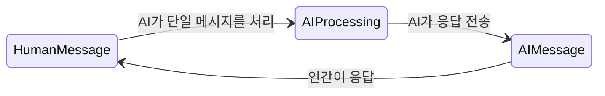
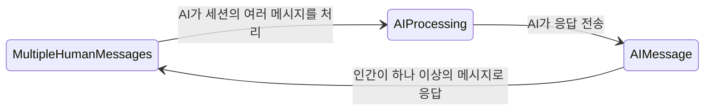
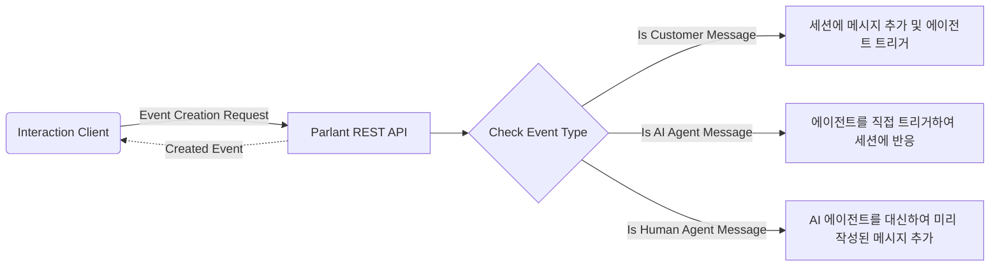
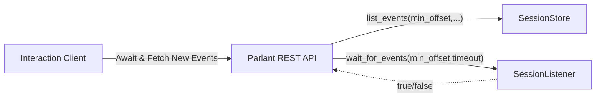

# Interaction Flow

## 동기

Parlant에서 Human/AI 인터페이스 설계에 대해 이해해야 할 첫 번째 중요한 점은, 내용뿐만 아니라 흐름에서도 자연스러운 대화를 촉진하도록 설계되었다는 것입니다.

대부분의 전통적인 챗봇 시스템(및 대부분의 LLM 인터페이스)은 단일 마지막 메시지를 기반으로 한 요청-응답 메커니즘에 의존합니다.

그러나 요즘 우리는 자연스러운 텍스트 인터페이스가 전통적인 모델에서 지원되지 않는 몇 가지를 허용해야 한다는 것을 알고 있습니다:

1. 인간은 종종 다른 쪽으로부터 응답을 받을 준비가 완전히 되기 전에 단일 메시지 이벤트 이상으로 자신을 표현합니다.
1. 그들의 의도에 관한 정보는 마지막 N개의 메시지뿐만 아니라 대화 전체에서 캡처되어야 합니다.

또한, 에이전트는 인간 메시지에 의해 트리거될 때뿐만 아니라 응답할 필요가 있을 수 있습니다. 예를 들어, 사용자에게 메시지가 수신되었는지 확인하기 위해 후속 조치를 취하거나, 다른 참여 전술을 시도하거나, 추가 정보로 응답하기 전에 시간을 벌기 위해, "확인하고 잠시 후 다시 연락드리겠습니다."와 같이 응답할 핗요가 있습니다.

## 솔루션

Parlant의 API와 엔진은 상호작용 세션과 관련하여 비동기 방식으로 작동하도록 설계되었습니다. 간단히 말해, 이는 인간 고객과 AI 에이전트 모두 언제든지, 임의의 수만큼 세션에 이벤트(메시지)를 자유롭게 추가할 수 있음을 의미합니다—마치 두 사람 사이의 실제 IM 앱 대화처럼.

### 메시지 보내기

위 다이어그램은 세션에 변경을 시작하는 API 흐름을 보여줍니다.
1. **고객 메시지:** 이 요청은 고객을 대신하여 세션에 새 메시지를 추가하고 AI 에이전트가 비동기적으로 응답하도록 트리거합니다. 이는 *Created Event*가 실제로 에이전트의 응답을 포함하지 않음을 의미합니다—그것은 시간이 지나면 올 것입니다—대신 생성되고 유지된 고객 이벤트의 ID(및 기타 세부 정보)를 포함합니다.
1. **AI 에이전트 메시지:** 이 요청은 전체 반응 엔진을 직접 활성화합니다. 에이전트는 관련 가이드라인과 툴을 매칭하고 활성화하며 응답을 생성합니다. 그러나 여기서 *Created Event*는 에이전트의 메시지가 아닙니다. 시간이 걸릴 수 있기 때문입니다. 대신 최종 에이전트의 메시지 이벤트와 동일한 *Trace ID*를 포함하는 *status event*를 반환합니다. 여기서 주목할 점은 대부분의 프론트엔드 클라이언트에서 이 생성된 이벤트는 일반적으로 무시되며, 주로 진단 목적으로 제공된다는 것입니다.
1. **인간 에이전트 메시지:** 때로는 인간(아마도 개발자)이 AI 에이전트를 대신하여 수동으로 메시지를 추가하는 것이 합리적일 수 있습니다. 이 요청을 통해 그렇게 할 수 있습니다. 여기서 *Created Event*는 생성되고 유지된 수동 작성 에이전트 메시지입니다.

### 메시지 받기

메시지가 비동기적으로, 그리고 잠재적으로 동시에 전송되므로, 메시지를 받는 것도 비동기 방식으로 수행되어야 합니다. 본질적으로, 우리는 언제든지 어느 쪽에서든 도착할 수 있는 새 메시지를 항상 기다려야 합니다.

Parlant는 새 이벤트를 나열하기 위한 long-polling, 시간 제한 API 엔드포인트로 이 기능을 구현합니다. 뒤에서 수행하는 작업은 다음과 같습니다:

새 메시지에 대한 요청을 받으면, 해당 요청에는 일반적으로 2개의 중요한 구성 요소가 있습니다: 1) 세션 ID; 및 2) 반환할 최소 이벤트 오프셋. 일반적으로 이 엔드포인트에 요청할 때, 프론트엔드 클라이언트는 세션 ID와 *마지막 알려진 이벤트의 오프셋 + 1*을 전달해야 합니다. 이렇게 하면 이 엔드포인트는 *새* 메시지가 도착할 때만 반환됩니다. 이 long-polling 요청을 루프로 실행하여 약 60초마다 시간 초과하고 UI에서 세션이 열려 있는 동안 요청을 갱신하는 것이 정상입니다. 도착 시기나 도착 원인에 관계없이 UI를 최신 메시지로 지속적으로 업데이트하는 것은 이 루프입니다.

요약하면, Parlant는 자연스럽고 현대적인 Human/AI 상호작용을 지원하는 유연한 대화형 API를 구현합니다.
