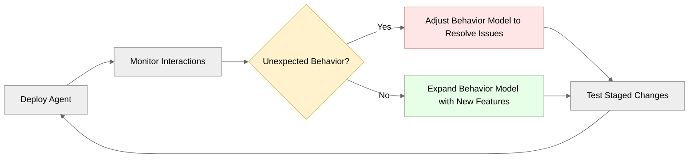

# Agentic 디자인 방법론

AI 에이전트를 구축하는 것은 전통적인 소프트웨어 개발과는 근본적으로 다른 패러다임 전환을 요구합니다. 이 글은 효과적인 고객 대면 에이전트를 만드는 데 필요한 고유한 과제, 방법론 및 디자인 원칙을 탐구합니다.

Parlant는 신뢰할 수 있는 에이전트 동작을 위한 도구를 제공하지만, 성공은 의미론적 디자인의 기술을 마스터하는 데 달려 있습니다. 즉, 자연스러운 사용자 상호작용을 유지하면서 대규모로 일관되게 작동하는 지침을 명확히 표현하는 방법을 배우는 것입니다.

## 확률적 동작 이해하기

AI 에이전트는 전통적인 소프트웨어 시스템과 다르게 작동합니다. 기존 개발에서는 결정론적 함수가 동일한 입력에 대해 일관된 출력을 생성합니다. 그러나 AI 에이전트는 통계 모델을 기반으로 구축되어, 동일한 입력이 모델의 학습된 패턴과 확률 분포에 따라 다양한 응답을 생성할 수 있습니다.

당연히, 본질적으로 불확실한 기반 위에 구축할 때는 디자인과 구현에 대한 다른 접근 방식이 필요합니다. 이것이 agentic 디자인에 대해 이해하고 받아들여야 할 첫 번째 중요한 사항입니다.

### 지침 해석 과제

전통적인 소프트웨어가 예측 가능한 결과로 명시적 명령을 실행하는 반면, LLM은 맥락적으로 지침을 해석하여 다양한 학습 데이터를 기반으로 세부 사항과 가정을 채워넣습니다. 그들은 이렇게 작동해야 합니다.

다음 가이드라인 예제를 고려해보세요:
```python
agent.create_guideline(
    condition="Customer is unhappy",
    action="Make them feel better"
)
```

조건과 지침 모두 너무 모호하여 바람직하지 않은 행동을 초래할 수 있습니다:
- 승인되지 않은 할인 제공
- 회사가 이행할 수 없는 약속
- 부적절한 커뮤니케이션 스타일 사용

> **경고: 해석 가변성**
>
> 도움이 되도록 훈련된 LLM은 충분한 맥락이나 구체성이 부족하더라도 요청을 이행하려고 시도합니다. 이는 모델에게는 적절해 보이지만 비즈니스 규칙이나 기대를 위반하는 응답으로 이어질 수 있습니다.

## 완전한 통제의 과제

Parlant가 LLM 위에 많은 컴플라이언스 메커니즘을 추가하지만, LLM 자체는 두 가지 근본적인 이유로 특정 주제에 대한 논의를 완전히 제한할 수 없다는 것을 이해하는 것이 중요합니다:

**1. 패턴 모방, 추론이 아님**: LLM은 실제로 논리적 의미에서 "추론"하지 않습니다. 그들이 생성하는 모든 것은 본질적으로 훈련 중 관찰된 표현 패턴을 모방하는 것입니다. LLM을 강력하지만 야생의 말로 생각하세요. 엄청난 능력을 가지고 있지만 효과적으로 "타는" 데는 기술과 뉘앙스가 필요합니다.

**2. 맥락적 모호성**: 신중하게 만든 조건과 행동조차도 다양하고 변화하는 상호작용 맥락에서 모호해질 수 있습니다. 한 시나리오에서 명확해 보이는 것이 다른 맥락에서는 다르게 해석될 수 있습니다.

### 컴플라이언스 전략

컴플라이언스 표준과 기대를 충족해야 하는 에이전트의 경우 계층화된 접근 방식이 필요합니다:

**최소 요구사항: 가이드라인 기반 경계**
가이드라인을 사용하면 다음을 할 수 있습니다:
1. 허용 가능한 동작에 대한 명확한 경계 설정
2. 특정 시나리오를 의도된 방식으로 처리하기 위한 신중한 넛지와 지침 제공
```python
await agent.create_guideline(
    condition="Customer asks about topics outside your designated scope",
    action="Politely decline to discuss the topic and redirect to what you can help with"
)
```

```python
await agent.create_guideline(
    condition="The patient wants an analysis of their lab results",
    action="Never provide any interpretation of the results. Instead, tell them to "
        "call our office and ask to speak with their doctor for a detailed analysis",
)
```

**강력한 솔루션: 정형 응답**
승인되지 않은 커뮤니케이션이 문제를 일으킬 수 있는 진정으로 중요한 상호작용의 경우, [정형 응답](https://parlant.io/docs/concepts/customization/canned-responses)을 구현하고 에이전트의 구성 모드를 `STRICT`로 설정하세요:

```python
await agent.create_canned_response(
    template="I can help you with account questions, but I'll need to connect you "
        "with a specialist for policy details. Would you like me to transfer you?"
)
```

정형 응답은 고위험 시나리오에서 에이전트가 사전 승인된 언어와 콘텐츠를 사용하여 승인되지 않은 진술의 가능성을 제거하도록 보장합니다. 예, 이것은 더 많은 작업이 필요하지만 반복적으로 추가할 수 있습니다. 핵심 통찰력은 백만 번의 상호작용 중 단 한 번도 책임을 만들지 않을 수 있는 에이전트를 구축하는 것입니다.

이러한 "심층 방어" 접근 방식은 LLM 작업이 완전히 제어하는 것이 아니라 안내하고, 조종하고, 제약하는 방법을 배우는 것을 의미한다는 것을 인정합니다. 또한 _에이전트의 동작이 허용 가능한 범위 내에 있는 한_, 응답에서 어느 정도의 유연성과 가변성을 허용해야 한다는 것을 의미합니다.

## 도구 호출 복잡성

에이전트가 외부 시스템과 상호작용해야 할 때, 도구(특정 작업을 수행하는 함수)를 사용합니다. 그러나 LLM은 전통적인 소프트웨어 개발에는 존재하지 않는 도구 호출 시 고유한 과제에 직면합니다.

### 매개변수 추측 문제

LLM은 명시적 사양이 아닌 대화 맥락을 기반으로 도구 매개변수를 결정해야 합니다. 이는 여러 일반적인 실패 패턴을 만듭니다:

1. **누락된 정보**: 에이전트는 맥락에 필요한 모든 매개변수가 없는 상태에서 도구를 호출하여 값을 추측하거나 환각하도록 유도할 수 있습니다.
1. **타입 혼동**: 에이전트가 사용자 ID가 예상되는 곳에 이메일 주소를 전달하거나, 정수가 필요한 곳에 문자열을 제공할 수 있습니다.
1. **맥락 오해석**: 대화 맥락에 여러 엔티티가 존재할 때, 에이전트가 매개변수에 잘못된 것을 사용할 수 있습니다.
1. **거짓 긍정 편향**: 여러 도구가 적용 가능해 보일 때, 에이전트가 최선의 선택이 아니더라도 관련성이 있어 보이는 첫 번째 도구를 호출할 수 있습니다.

사용자가 "다음 주에 Sarah와 회의를 잡아줘"라고 말하는 경우를 고려해보세요. 에이전트는 다음을 결정해야 합니다:
- 어떤 Sarah인지 (여러 명이 존재하는 경우)
- "다음 주"가 무슨 날/시간을 의미하는지
- 어떤 유형의 회의인지
- 회의가 얼마나 길어야 하는지
- 어떤 캘린더 시스템을 사용할지

각각의 모호성은 잠재적 실패 지점입니다. 따라서 Parlant는 도구의 맥락적 관련성과 정확한 매개변수화 기대치를 안내하는 특정 제어 기능을 제공합니다.

> **팁: 도구 디자인 심층 분석**
>
> 도구 호출은 매개변수 해석부터 다단계 오케스트레이션 실패에 이르기까지 에이전트에게 고유한 과제를 제시합니다. Parlant를 사용한 고객 대면 시나리오에 특히 적합한 에이전트 친화적 도구 설계에 대한 포괄적인 지침은 다음을 참조하세요:
>
> - [도구 문서](https://parlant.io/docs/concepts/customization/tools) - Parlant의 가이드된 도구 사용 접근 방식
> - [Agentic API 디자인 블로그 포스트](https://parlant.io/blog/what-no-one-tells-you-about-agentic-api-design) - 신뢰할 수 있는 에이전트 친화적 API 구축을 위한 상세한 전략

## 반복적 개발 프로세스

현실적으로, 의미론적 동작은 전통적인 소프트웨어 요구사항처럼 사전에 완전히 명시될 수 없습니다. 대신, 에이전트 디자인은 관찰된 상호작용과 피드백을 기반으로 동작을 가장 잘 개선하는 반복적 프로세스를 따릅니다.

### 1단계: 기본 에이전트 구현

시작할 때는 정의할 수 있는 한 에이전트의 핵심 기능과 해피 패스 구현에 집중하세요. 이는 가장 일반적인 시나리오를 다루는 기본 가이드라인과 여정을 정의하는 것을 의미합니다.

엣지 케이스를 다루기 전에 핵심 기능을 작동시키는 데 집중하세요. 좋은 소식은 Parlant의 프레임워크를 사용하면 간단하게 시작하고 시간이 지남에 따라 상당히 직관적인 방식으로 복잡성을 구축할 수 있다는 것입니다.

### 2단계: 모니터링 및 분석

통제된 환경에서 에이전트를 배포하고 상호작용을 모니터링하세요. 예상치 못한 동작은 에이전트가 지침을 의도와 다르게 해석하는 방법에 대한 통찰력을 제공합니다. 또한 사용자가 에이전트와 _실제로_ 상호작용하는 방식을 보여주는데, 이는 종종 우리가 디자인할 때 초기에 예상했던 것과 다소 다릅니다!

다음 상호작용 패턴을 추적하세요:
- 에이전트가 예상 응답에서 벗어나는 상황
- 바람직하지 않은 동작으로 이어지는 트리거
- 사용자 혼란, 좌절 지점 또는 특이한 상호작용 패턴



### 3단계: 타겟 개선

Parlant의 구조화된 행동 모델링 접근 방식을 활용하여 모니터링 중 식별된 특정 문제를 해결하세요. 관찰된 문제를 대상으로 하는 [가이드라인](https://parlant.io/docs/concepts/customization/guidelines)을 추가하세요:

```python
# 문제: 에이전트가 명시적 거부 후에도 업셀 제안을 반복함
await agent.create_guideline(
    condition="Customer has explicitly declined a premium upgrade in this conversation",
    action="Do not mention upgrades again in this session"
)
```
```python
# 문제: 약속이 불가능할 때 에이전트가 모호한 응답을 제공함
await agent.create_guideline(
    condition="Customer requests a specific appointment time that is not available",
    action="Immediately provide the three closest available time slots as concrete alternatives",
    tools=[get_available_slots],
)
```


### 가이드라인 구체성 요구사항
효과적인 가이드라인은 적용의 시간적 범위를 명시하고 구체적이고 실행 가능한 지침을 제공합니다.

가이드라인을 설계할 때, 다음과 같은 일반적인 모호성 원인을 다루는 것이 가장 좋습니다:

**행동 시간적 범위**: 가이드라인의 효과는 얼마나 오래 지속되어야 하나요?
- "...대화 전체에 걸쳐" - 현재 세션 전체에 적용
- "...즉시" - 다음 응답에만 적용
- "...고객이...할 때까지" - 특정 조건이 변경될 때까지 적용

**행동 명확성**: 에이전트가 정확히 무엇을 해야 하나요?
- 응답 내용 안내: "그들에게...라고 말하세요"
- 객관적 기준 명시: "가장 가까운 세 가지 대안" (X) "일부 대안" (O)

**조건 정밀도**: 이 가이드라인은 정확히 언제 적용되나요?
- "고객이 명시적으로 거부했음"이 "고객이 불만족함"보다 명확함
- "고객이 특정 정책에 대해 묻고 정확한 답변이 없음"이 "확실하지 않음"보다 정확함

## 확률적 동작 관리

에이전트 디자인은 유연성과 예측 가능성 사이의 균형이 필요합니다. 에이전트는 비즈니스 규칙을 일관되게 준수하면서도 다양한 사용자 입력을 자연스럽게 처리할 수 있는 충분한 자유가 필요합니다.

### 제한된 유연성 구현

효과적인 가이드라인은 자연스러운 대화 흐름을 허용하면서 명확한 경계를 제공합니다:

```python
# 너무 경직적 - 스크립트처럼 느껴짐
await agent.create_guideline(
    condition="Customer asks about pricing",
    action="Say exactly: 'Our premium plan is $99/month'"
)
```
```python
# 너무 개방적 - 예측 불가능한 동작
await agent.create_guideline(
    condition="Customer asks about pricing",
    action="Help them understand our pricing"
)
```
```python
# 균형 잡힌 접근 - 구체적이지만 유연함
await agent.create_guideline(
    condition="Customer asks about pricing",
    action="Explain our pricing tiers clearly, emphasize value, "
        "and ask about their specific needs to recommend the best fit"
)
```

### 엣지 케이스 처리

에이전트는 예상치 못한 입력과 엣지 케이스를 만날 것입니다. 이러한 상황을 우아하게 처리하도록 가이드라인을 설계하세요:

```python
# 정책 질문에 대한 즉각적인 에스컬레이션
await agent.create_guideline(
    condition="Customer asks about a specific policy and you don't have the exact answer",
    action="Tell them you want to ensure they get accurate policy information, "
        "and offer to connect them to human support who can provide the specifics"
)
```
```python
# 경쟁사 질문을 대화당 한 번 리디렉션
await agent.create_guideline(
    condition="Customer asks about competitor products or pricing",
    action="Acknowledge their question, explain that you focus on our own products, "
        "and ask specifically what features or capabilities they're looking for "
        "so you can recommend the best option from our lineup"
)
```

## 구조화된 상호작용

복잡한 다단계 프로세스의 경우, 가이드라인만으로는 충분한 구조를 제공하지 못할 수 있습니다. [여정](https://parlant.io/docs/concepts/customization/journeys)가 이러한 시나리오에 대한 더 나은 접근 방식을 제공합니다.

### 여정을 사용해야 하는 경우

에이전트가 복잡한 다단계 상호작용으로 어려움을 겪을 때 여정 구현을 고려하세요:

```python
# 예약 흐름을 처리하기 위한 많은 가이드라인 대신, 구조화된 여정 사용...
booking_journey = await agent.create_journey(
    title="Book Appointment",
    conditions=["Customer wants to schedule an appointment"],
    description="Guide customer through appointment booking process"
)

# 명확하고 유연한 흐름 생성
t1 = await booking_journey.initial_state.transition_to(
    chat_state="Ask what type of service they need"
)
t2 = await t1.target.transition_to(
    tool_state=check_availability_for_servic_for_servicee,
)
t3 = await t2.target.transition_to(
    chat_state="Offer available time slots"
)
# ... 여정을 계속 구축
```

여정는 유연성을 유지하면서 대화 구조를 제공하여, 에이전트가 정의된 프레임워크 내에서 다양한 상호작용 패턴에 적응할 수 있도록 합니다.

## 고객 대면 에이전트를 위한 개발 철학

고객 대면 에이전트를 구축하는 것은 전통적인 소프트웨어 개발에는 존재하지 않는 여러 경쟁하는 우선순위의 균형이 필요합니다.

### 사용자 경험 vs. 비즈니스 통제

전통적인 사용자 인터페이스는 사용자에게 명시적 옵션을 제공합니다—버튼, 양식, 메뉴. 사용자는 인터페이스가 허용하는 것만 할 수 있습니다. 대화형 에이전트는 이 관계를 반전시킵니다: 사용자는 무엇이든 말할 수 있고, 에이전트는 비즈니스 제약 내에서 어떻게 응답할지 결정해야 합니다.

이것은 독특한 긴장을 만듭니다. 사용자는 자연스럽고 도움이 되는 상호작용을 기대하지만, 비즈니스는 예측 가능하고 규정을 준수하는 동작이 필요합니다. 에이전트는 정의된 경계 내에서 작동하면서도 대화형으로 느껴져야 합니다.

### 대화 디자인 원칙

**맥락 보존**: 단계별로 데이터를 캡처하는 웹 양식과 달리, 대화는 비선형적입니다. 사용자는 순서 없이 정보를 제공하거나, 마음을 바꾸거나, 멈추거나, 반복하거나, 벗어날 수 있습니다. 에이전트는 자연스러운 대화 흐름을 허용하면서 컴플라이언스를 유지해야 합니다.

**점진적 공개**: 모든 옵션을 선행 제시하는 것보다, 에이전트는 맥락적으로 기능을 드러낼 수 있습니다. 이것은 사용자 요구가 나타날 때 응답하는 가이드라인이 필요합니다.

**복구 메커니즘**: 대화가 궤도를 벗어났을 때, 에이전트는 사용자를 좌절시키지 않고 리디렉션하기 위한 명시적 전략이 필요합니다. 이것은 종종 일반적인 편차를 처리하는 여정 범위 가이드라인이 필요합니다.

### 프로토콜 준수 및 커뮤니케이션 표준

고객 대면 에이전트는 확립된 프로토콜을 따르고 비즈니스 표준에 부합하는 방식으로 커뮤니케이션해야 합니다. 주요 과제는 에이전트가 조직이 승인하는 방식으로 사물을 표현하면서 오해의 소지가 있는 정보를 제공하지 않도록 하는 것입니다. 여기에는 브랜딩 가이드라인도 포함됩니다.

Parlant는 커뮤니케이션 표준을 유지하기 위한 네 가지 주요 도구를 제공합니다:

1. **가이드라인:** 행동 경계 및 응답 패턴 설정
1. **여정:** 적절한 프로토콜 준수를 보장하기 위한 복잡한 상호작용 구조화
1. **정형 응답:** 맞춤형 커뮤니케이션을 위한 정확한 표현 보장
1. **리트리버:** 정확하고 최신 정보에 에이전트의 응답을 기반으로 함

이러한 계층화된 접근 방식은 에이전트가 자연스러운 대화 흐름을 유지하면서 프로토콜을 정확하게 따르고, 치명적으로 오해의 소지가 있는 말을 하지 않으며, 항상 비즈니스 승인 방식으로 정보를 표현하도록 보장합니다.

## 행동 모델링의 기술

agentic 개발의 주요 과제는 기술적인 것이 아닙니다. 효과적인 상호작용을 설계하고 이러한 디자인을 대규모로 안정적으로 작동하고 고객이 실제로 참여하는 지침으로 번역하는 것입니다.

효과적인 행동 모델링은 종종 다음을 결합합니다:

**도메인 지식**: 고객이 필요로 하는 것뿐만 아니라 그들이 그러한 요구를 어떻게 표현하는지, 무엇이 그들을 좌절시키는지, 무엇이 그들의 신뢰를 구축하는지 이해하기.

**대화 흐름 디자인**: 필요한 정보를 효율적으로 수집하면서 자연스럽게 느껴지는 다회전 상호작용을 구조화하는 방법 알기.

**지침 디자인**: 일관된 LLM 해석을 위해 충분히 명확하고 정확하지만 자연스러운 대화와 적응성을 위해 충분히 유연한 가이드라인을 작성하는 기술.

### 실용적 디자인 전략

**기능이 아닌 사용자 스토리로 시작**: "에이전트가 반품을 처리해야 함" 대신, 고객의 입장이 되어 "잘못된 사이즈를 구입한 고객으로서, 교환하고 싶어요..."

**점진적 복잡성 사용**: 일반적인 경우를 처리하는 가능한 가장 간단한 행동 모델로 시작하세요. 특정 엣지 케이스가 발견될 때만 복잡성을 추가하세요. Parlant는 이러한 반복을 상당히 직관적으로 만듭니다.

**의도를 구현에서 분리**: 가이드라인은 사용할 특정 단어보다는 달성할 명확한 결과에 초점을 맞춰야 합니다. 이를 통해 에이전트가 일관된 목표를 유지하면서 접근 방식을 적응시킬 수 있습니다.

## Agentic 개발의 이중 과제

Agentic 개발은 두 가지 별개이지만 관련된 문제를 포함합니다:

1. **지침 명확히 하기**: 의도한 동작을 포착하는 고품질 행동 모델 설계
2. **컴플라이언스 보장**: 에이전트가 실제로 이러한 지침을 대규모로 일관되게 따르도록 보장

Parlant는 두 번째 과제를 효과적으로 해결합니다. 기대사항을 명확하게 명시하면, Parlant의 가이드라인 매칭, 여정 관리 및 시행 메커니즘이 사양에 대한 신뢰할 수 있는 준수를 보장합니다. 프레임워크는 관련 가이드라인을 동적으로 선택하고, 대화 맥락을 관리하며, 에이전트 출력을 감독하는 복잡한 작업을 처리합니다.

그러나 Parlant는 첫 번째 과제를 대신 해결할 수 없습니다. 프레임워크는 대화 동작을 표현하기 위한 강력한 도구를 제공하지만, 이러한 도구를 효과적으로 사용하는 방법을 배우는 것은 개발자로서의 우리에게 달려 있습니다. 이것이 진정한 전문성이 있는 곳입니다—Parlant의 SDK를 이해하는 것뿐만 아니라 실제로 작동하는 대화를 설계하고 지침을 명확히 하는 기술을 개발하는 것입니다.

**프레임워크의 역할**: Parlant는 잘 설계된 가이드라인이 수천 번의 상호작용에 걸쳐 안정적으로 따라지도록 보장합니다. 맥락 관리, 가이드라인 선택 및 행동 시행의 기술적 복잡성을 처리합니다.

**개발자의 역할**: 너무 모호하지도 너무 경직적이지도 않은 가이드라인을 작성하고, 실제 사용자 동작을 수용하는 여정을 설계하며, 언제 구조를 추가할지 언제 유연성을 허용할지에 대한 판단력을 개발하는 방법을 배우기.

이러한 책임 분담은 agentic 개발을 마스터하는 것이 Parlant의 기능에 대한 기술적 능숙함과 행동 모델링 전문 지식 모두를 필요로 한다는 것을 의미합니다. 가장 성공적인 구현은 행동 모델링이 실제 테스트를 통한 지속적인 개선을 포함하는 전문 기술임을 인식합니다.

## 구현 가이드라인: 요약

효과적인 agentic 디자인은 확률적 동작을 효과적으로 다루는 방법을 이해해야 합니다:

1. **기본 기능으로 시작** - 엣지 케이스를 다루기 전에 핵심 기능 구현
2. **체계적으로 모니터링** - 개선 영역을 식별하기 위해 에이전트 동작 추적
3. **반복적으로 개선** - 가설적 문제가 아닌 관찰된 문제를 기반으로 가이드라인 추가
4. **유연성과 통제의 균형** - 자연스러운 상호작용을 허용하면서 명확한 경계 제공
5. **복잡한 흐름 구조화** - 다단계 프로세스에 여정 사용
6. **투명성 유지** - 기능과 제한 사항을 명확하게 전달

주요 과제는 Parlant의 기능에 대한 기술적 숙달이 아니라 대규모로 안정적으로 작동하는 지침을 명확히 하는 행동 모델링 전문성을 개발하는 것입니다. Parlant는 시행을 처리합니다—여러분의 역할은 명확한 agentic 디자인의 기술을 배우는 것입니다.
