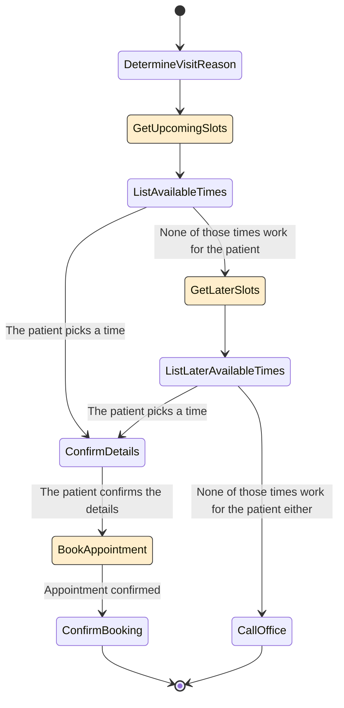

# Healthcare 에이전트 예제

이 페이지는 Parlant를 사용하여 두 가지 고객 여정을 가진 healthcare 에이전트를 설계하고 구축하는 과정을 안내합니다.
1. **약속 예약**: 에이전트가 환자가 약속 시간을 찾도록 돕습니다.
1. **검사 결과**: 에이전트가 환자의 검사 결과를 검색하고 설명합니다.


다음을 배우게 됩니다:
- 기본 도메인 지식으로 에이전트를 정렬하기.
- **상태**와 **전환**을 사용하여 **여정** 정의하기.
- **가이드라인**을 사용하여 대화 엣지 케이스에서 에이전트의 동작 제어하기.
- **도구**를 사용하여 에이전트를 실제 작업 및 데이터에 연결하기.
- 모호한 사용자 쿼리 명확히 하기.

이 섹션은 결코 Parlant의 기능에 대한 포괄적인 가이드는 아니지만, 기본 사항이 어떻게 보이는지, 그리고 Parlant로 자신의 에이전트를 구축하는 방법에 대한 확실한 아이디어를 제공합니다. 시작해봅시다!

> **정보: 행동 모델링의 기술**
>
> 복잡하고 신뢰할 수 있는 고객 대면 AI 에이전트를 구축하는 것은 어려운 작업입니다. 과대광고 기계가 다르게 말하도록 두지 마세요.
>
> 올바른 프레임워크를 갖는 것만이 아닙니다. 대화를 자동화할 때, 우리는 인간 대화의 복잡한 의미론을 자동화하는 것입니다. 매우 현실적인 의미에서, 이것은 우리가 지침과 행동 모델을 신중하게 설계해야 함을 의미합니다. 에이전트가 진정으로 우리가 기대하는 대로 행동하도록 보장하기 위해 명확하고 적절한 구체성 수준이어야 합니다.
>
> Parlant는 지침을 표현하고 시행하는 도구를 제공하지만, 이를 설계하는 것은 그 자체로 기술이며, 올바르게 하려면 연습이 필요합니다. 하지만 일단 하게 되면, 기능적이고 신뢰할 수 있을 뿐만 아니라 매력적이고 효과적인 에이전트를 구축할 수 있습니다.


## 환경 준비
시작하기 전에 다음을 확인하세요
1. Parlant를 [설치](https://parlant.io/docs/quickstart/installation)하고 Python 환경을 설정했습니다.
1. NLP 제공업체를 선택하고 서버에 연결했습니다 ([설치 페이지](https://parlant.io/docs/quickstart/installation)에도 있음).

> **팁: 코드 다운로드**
>
> 이 완전히 작동하는 예제의 실행 가능한 코드는 [Parlant의 GitHub 저장소](https://github.com/emcie-co/parlant)의 `examples/` 폴더에서 찾을 수 있습니다.

## 개요

다음 단계로 에이전트를 구현하겠습니다:

1. 간단한 에이전트 설명으로 베이스라인 프로그램을 생성합니다.
1. 상태, 전환 및 도구와 함께 **예약** 여정을 추가합니다.
1. 유사한 방식으로 **검사 결과** 여정을 추가합니다.

## 시작하기
전체 프로그램을 단일 파일 `healthcare.py`에 구현하겠습니다만, 실제 사용 사례에서는 더 나은 조직을 위해 여러 파일로 분할하고 싶을 것입니다. 이러한 경우 좋은 접근 방식은 여정당 하나의 파일을 갖는 것입니다.

하지만 지금은 초기 에이전트를 생성해봅시다.

```python
# healthcare.py

import parlant.sdk as p
import asyncio

async def add_domain_glossary(agent: p.Agent) -> None:
  await agent.create_term(
    name="Office Phone Number",
    description="The phone number of our office, at +1-234-567-8900",
  )

  await agent.create_term(
    name="Office Hours",
    description="Office hours are Monday to Friday, 9 AM to 5 PM",
  )

  await agent.create_term(
    name="Charles Xavier",
    synonyms=["Professor X"],
    description="The renowned doctor who specializes in neurology",
  )

  # Add other specific terms and definitions here, as needed...

async def main() -> None:
    async with p.Server() as server:
        agent = await server.create_agent(
            name="Healthcare Agent",
            description="Is empathetic and calming to the patient.",
        )

        await add_domain_glossary(agent)


if __name__ == "__main__":
    asyncio.run(main())
```

## 예약 여정 생성하기
Parlant에서 여정가 어떻게 작동하는지 이해하려면 [여정 문서](https://parlant.io/docs/concepts/customization/journeys)를 확인하세요. 여기서는 바로 시작하겠지만, 먼저 해당 문서를 검토하는 것이 권장됩니다.

### 도구 추가
먼저, 이 여정을 지원하는 데 필요한 도구를 추가합니다.

```python
from datetime import datetime

@p.tool
async def get_upcoming_slots(context: p.ToolContext) -> p.ToolResult:
  # Simulate fetching available times from a database or API
  return p.ToolResult(data=["Monday 10 AM", "Tuesday 2 PM", "Wednesday 1 PM"])

@p.tool
async def get_later_slots(context: p.ToolContext) -> p.ToolResult:
  # Simulate fetching later available times
  return p.ToolResult(data=["November 3, 11:30 AM", "November 12, 3 PM"])

@p.tool
async def schedule_appointment(context: p.ToolContext, datetime: datetime) -> p.ToolResult:
  # Simulate scheduling the appointment
  return p.ToolResult(data=f"Appointment scheduled for {datetime}")
```

> **팁: Parlant의 도구**
>
> Parlant는 대부분의 agentic 프레임워크보다 더 복잡한 도구 시스템을 가지고 있습니다. 왜냐하면 대화형의 민감한 고객 대면 사용 사례에 최적화되어 있기 때문입니다. [도구 섹션](https://parlant.io/docs/concepts/customization/tools)의 문서를 자세히 살펴보고 그 힘을 배우는 것을 강력히 권장합니다.

### 여정 구축하기
이제 다음 다이어그램에 따라 여정을 생성하겠습니다:



```python
# <<Add this function>>
async def create_scheduling_journey(server: p.Server, agent: p.Agent) -> p.Journey:
  # Create the journey
  journey = await agent.create_journey(
    title="Schedule an Appointment",
    description="Helps the patient find a time for their appointment.",
    conditions=["The patient wants to schedule an appointment"],
  )

  # First, determine the reason for the appointment
  t0 = await journey.initial_state.transition_to(chat_state="Determine the reason for the visit")

  # Load upcoming appointment slots into context
  t1 = await t0.target.transition_to(tool_state=get_upcoming_slots)

  # Ask which one works for them
  # We will transition conditionally from here based on the patient's response
  t2 = await t1.target.transition_to(chat_state="List available times and ask which ones works for them")

  # We'll start with the happy path where the patient picks a time
  t3 = await t2.target.transition_to(
    chat_state="Confirm the details with the patient before scheduling",
    condition="The patient picks a time",
  )

  t4 = await t3.target.transition_to(
    tool_state=schedule_appointment,
    condition="The patient confirms the details",
  )
  t5 = await t4.target.transition_to(chat_state="Confirm the appointment has been scheduled")
  await t5.target.transition_to(state=p.END_JOURNEY)

  # Otherwise, if they say none of the times work, ask for later slots
  t6 = await t2.target.transition_to(
    tool_state=get_later_slots,
    condition="None of those times work for the patient",
  )
  t7 = await t6.target.transition_to(chat_state="List later times and ask if any of them works")

  # Transition back to our happy-path if they pick a time
  await t7.target.transition_to(state=t3.target, condition="The patient picks a time")

  # Otherwise, ask them to call the office
  t8 = await t7.target.transition_to(
    chat_state="Ask the patient to call the office to schedule an appointment",
    condition="None of those times work for the patient either",
  )
  await t8.target.transition_to(state=p.END_JOURNEY)

  return journey
```

그런 다음 `main` 함수에서 이 함수를 호출하여 에이전트에 여정을 추가하세요:

```python
async def main() -> None:
  async with p.Server() as server:
    agent = await server.create_agent(
      name="Healthcare Agent",
      description="Is empathetic and calming to the patient.",
    )

    # <<Add this line>>
    scheduling_journey = await create_scheduling_journey(server, agent)
```

### 엣지 케이스 처리
실제 시나리오에서 환자는 항상 여정의 스크립트된 경로를 따르지 않습니다. 질문을 하거나, 우려를 표현하거나, 다른 예상치 못한 응답을 제공할 수 있습니다.

Parlant 에이전트에게 이것은 그들의 전문 분야입니다! 여전히 환자에게 맥락적으로 응답할 수 있지만, 관찰한 특정 시나리오에서 *어떻게* 응답하는지 안내하고 개선하고 싶을 수 있습니다.

이를 위해 에이전트에 **가이드라인**을 추가할 수 있습니다. 가이드라인은 에이전트에게 특정 상황에서 어떻게 응답해야 하는지 알려주는 맥락적 규칙과 같습니다. 그리고 특정 여정에 범위를 지정하여 에이전트가 해당 여정에 있을 때만 적용되도록 할 수 있습니다.

예약 여정에서 일부 일반적인 엣지 케이스를 처리하기 위해 에이전트에 몇 가지 가이드라인을 추가해봅시다.

```python
async def create_scheduling_journey(server: p.Server, agent: p.Agent) -> p.Journey:
  # ... continued

  # <<Add this to the end of the create_scheduling_journey function>>

  await journey.create_guideline(
    condition="The patient says their visit is urgent",
    action="Tell them to call the office immediately",
  )

  # Add more edge case guidelines as needed...

  return journey
```

### 프로그램 실행
프로그램을 실행하면 먼저 Parlant가 구성의 의미론적 속성을 평가하는 것을 볼 수 있습니다. 이것은 가이드라인과 여정가 백그라운드에서 검색, 처리 및 준수되는 방식을 최적화하기 위해 수행됩니다.


서버가 준비되면 브라우저를 열고 [http://localhost:8800](http://localhost:8800)으로 이동하여 에이전트와 상호작용하세요.


> **경고: 지원되지 않는 쿼리 처리**
>
> 이 시점에서 에이전트가 지식과 능력의 경계를 완전히 벗어나면서 고객을 지원하려고 시도하는 것을 알 수 있습니다. 이것은 LLM에서는 정상이지만, 많은 실제 사용 사례에서는 용납할 수 없습니다.
>
> Parlant는 에이전트의 (잘못된) 동작에 대한 절대적인 통제를 달성하기 위한 여러 구조화된 방법을 제공합니다. 이 예제는 시작일 뿐입니다. Parlant에 대해 더 많이 배우면 실제로 신뢰할 수 있는 에이전트를 배포하는 데 도움이 될 것이라고 확신하세요.


## 검사 결과 여정 생성하기
이 여정는 다른 여정(그리고 구축하게 될 다른 여정)와 매우 유사한 구조이므로 빠르게 진행하겠습니다.

### 도구 추가

```python
@p.tool
async def get_lab_results(context: p.ToolContext) -> p.ToolResult:
  # Simulate fetching lab results from a database or API,
  # using the customer ID from the context.
  lab_results = await MY_DB.get_lab_results(context.customer_id)

  if lab_results is None:
    return p.ToolResult(data="No lab results found for this patient.")

  return p.ToolResult(data={
    "report": lab_results.report,
    "prognosis": lab_results.prognosis,
  })
```

### 여정 구축하기
```python
async def create_lab_results_journey(server: p.Server, agent: p.Agent) -> p.Journey:
  # Create the journey
  journey = await agent.create_journey(
    title="Lab Results",
    description="Retrieves the patient's lab results and explains them.",
    conditions=["The patient wants to see their lab results"],
  )

  t0 = await journey.initial_state.transition_to(tool_state=get_lab_results)

  await t0.target.transition_to(
    chat_state="Tell the patient that the results are not available yet, and to try again later",
    condition="The lab results could not be found",
  )

  await t0.target.transition_to(
    chat_state="Explain the lab results to the patient - that they are normal",
    condition="The lab results are good - i.e., nothing to worry about",
  )

  await t0.target.transition_to(
    chat_state="Present the results and ask them to call the office "
     "for clarifications on the results as you are not a doctor",
    condition="The lab results are not good - i.e., there's an issue with the patient's health",
  )

  # Handle edge cases with guidelines...

  await agent.create_guideline(
    condition="The patient presses you for more conclusions about the lab results",
    action="Assertively tell them that you cannot help and they should call the office"
  )

  return journey
```

마지막으로 `main` 함수에서 이 함수를 호출하여 에이전트에 여정을 추가하세요:

```python
async def main() -> None:
  async with p.Server() as server:
    agent = await server.create_agent(
      name="Healthcare Agent",
      description="Is empathetic and calming to the patient.",
    )

    scheduling_journey = await create_scheduling_journey(server, agent)
    # <<Add this line>>
    lab_results_journey = await create_lab_results_journey(server, agent)
```

프로그램을 재시작하고 브라우저를 열어 [http://localhost:8800](http://localhost:8800)으로 이동하여 에이전트와 상호작용하세요. _"내 검사 결과가 나왔나요?"_ 또는 _"약속을 잡고 싶어요"_와 같은 말을 해보세요.

## 환자 의도 명확히 하기
경우에 따라 환자가 여러 가지 방식으로 해석될 수 있는 말을 하여 어떤 행동을 취해야 할지 또는 무엇을 달성하려고 하는지에 대한 혼란을 초래할 수 있습니다.

이를 처리하는 쉬운 방법은 **명확화**를 사용하는 것입니다. 여러 행동을 취할 수 있을 때 에이전트가 환자에게 의도를 명확히 하도록 요청합니다. 방법은 다음과 같습니다:

```python
async def main() -> None:
  async with p.Server() as server:
    agent = await server.create_agent(
      name="Healthcare Agent",
      description="Is empathetic and calming to the patient.",
    )

    scheduling_journey = await create_scheduling_journey(server, agent)
    lab_results_journey = await create_lab_results_journey(server, agent)

    # <<Add the following lines>>

    # First, create an observation of an ambiguous situation
    status_inquiry = await agent.create_observation(
      "The patient asks to follow up on their visit, but it's not clear in which way",
    )

    # Use this observation to disambiguate between the two journeys
    await status_inquiry.disambiguate([scheduling_journey, lab_results_journey])
```

이제 환자가 후속 조치에 대해 모호한 방식으로 문의하면, 에이전트는 약속을 예약하려는 것인지 검사 결과를 보려는 것인지 명확히 하도록 요청할 것입니다.

프로그램을 재시작하고 브라우저를 열어 [http://localhost:8800](http://localhost:8800)으로 이동하여 에이전트와 상호작용하세요. _"지난 방문에 대해 후속 조치가 필요합니다"_와 같은 말을 해보고 에이전트가 어떻게 응답하는지 확인하세요.

## 전역 가이드라인
일반적으로 특정 여정가 아닌 에이전트의 모든 여정에 적용하려는 가이드라인이 있을 수 있습니다(또는 환자가 여정 중간에 있지 않은 경우에도). 예를 들어, 보험 제공업체에 대한 정보를 정보에 입각한 방식으로 제공하고 싶을 수 있습니다.

이를 달성하려면 특정 여정가 아닌 에이전트 자체에 가이드라인을 추가하기만 하면 됩니다.

```python
await agent.create_guideline(
  condition="The patient asks about insurance",
  action="List the insurance providers we accept, and tell them to call the office for more details",
  tools=[get_insurance_providers],
)

await agent.create_guideline(
  condition="The patient asks to talk to a human agent",
  action="Ask them to call the office, providing the phone number",
)

await agent.create_guideline(
  condition="The patient inquires about something that has nothing to do with our healthcare",
  action="Kindly tell them you cannot assist with off-topic inquiries - do not engage with their request.",
)
```

## 다음 단계
1. 이 예제의 실행 가능한 코드 파일을 다운로드하고 시도해보세요: [healthcare.py](https://github.com/emcie-co/parlant/blob/develop/examples/healthcare.py)
1. 정형 응답으로 에이전트 메시지의 콘텐츠와 스타일을 조정하고 제약하세요: [정형 응답](https://parlant.io/docs/concepts/customization/canned-responses)
1. [프로덕션 환경](https://parlant.io/docs/category/production)에서 에이전트를 배포하는 방법을 배우세요
1. 에이전트와 상호작용하기 위해 웹사이트에 [React 위젯](https://github.com/emcie-co/parlant-chat-react)을 추가하세요
