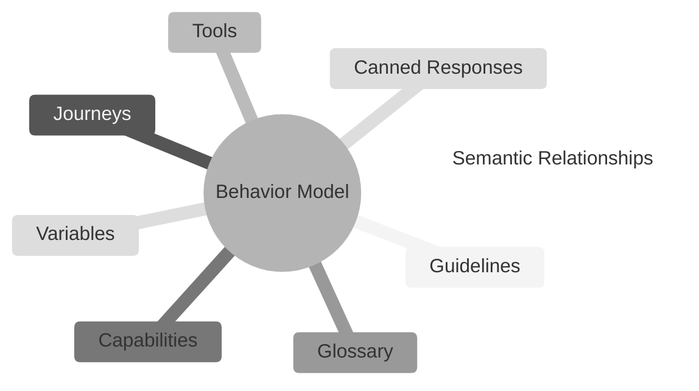
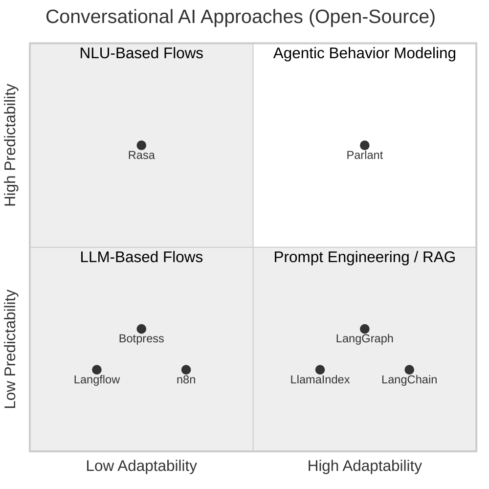

# 동기

어떤 에이전트 프레임워크를 다운로드하고 AI 에이전트를 구축했다고 가정해봅시다—훌륭합니다! 그러나 실제로 테스트해보니 많은 고객 상호작용을 제대로 처리하지 못하는 것을 보게 됩니다. 비즈니스 전문가들이 불만족스러워합니다. 프롬프트가 엉망이 되고 있습니다. 무엇을 해야 할까요?

**Agentic Behavior Modeling (ABM)**의 세계로 들어가세요: 에이전트가 사용자와 상호작용하는 방식을 제어하는 새로운 강력한 접근 방식입니다.

행동 모델은 특정 도메인이나 사용 사례에 에이전트를 지향하는 구조화되고 맞춤화된 원칙, 행동, 목표 및 근거 진실의 집합입니다.



#### 왜 행동 모델링인가?

LLM 에이전트가 당신이 원하는 것을 말하고 행동하도록 하는 문제는 고객 대면 에이전트를 구축하는 거의 모든 사람이 경험하는 어려운 문제입니다. ABM이 이 문제를 해결하기 위한 다른 접근 방식과 어떻게 비교되는지 알아보겠습니다.

- **플로우 엔진**은 턴별 대화 플로우차트를 구축하는데, 사용자가 미리 정의된 스크립트에 따라 상호작용하도록 강제합니다. 이러한 경직된 접근 방식은 낮은 사용자 참여와 신뢰로 이어지는 경향이 있습니다. 대조적으로, **ABM 엔진**은 비즈니스 규칙을 준수하면서 사용자의 자연스러운 상호작용 패턴에 동적으로 적응합니다.

- **자유 형식 프롬프트 엔지니어링**은 그래프 기반 오케스트레이션이든 시스템 프롬프트든 일관성 없고 신뢰할 수 없는 행동 준수로 이어지는 경우가 많아 요구사항과 기대를 지키지 못합니다. 반대로, **ABM 엔진**은 명확한 의미론적 구조와 주석을 활용하여 비즈니스 규칙에 대한 준수를 촉진합니다.



## Parlant란 무엇인가?

Parlant는 LLM 에이전트를 위한 오픈소스 **ABM 엔진**으로, 다양한 시나리오에서 LLM 에이전트가 사용자와 상호작용하는 방식을 정밀하게 제어하는 데 사용할 수 있습니다.

Parlant는 고객 대면 에이전트로 빠르게 시작하고 행동 모델링 프로세스를 가능한 한 쉽게 만드는 데 도움이 되는 수많은 검증된 기능이 사전 구축된 완전한 프레임워크입니다.

## 왜 Parlant인가?

많은 대화형 AI 사용 사례는 사용자와 상호작용할 때 비즈니스 규칙에 대한 엄격한 준수가 필요합니다. 그러나 지금까지 이것은 LLM으로 달성하기가 매우 어려웠습니다. 적어도 일관성이 문제가 될 때는 말입니다.

Parlant는 이 과제를 해결하기 위해 구축되었습니다. 신중하게 설계된 규칙, 엔티티 및 관계를 통해 대화 동작을 모델링하는 구조화되고 개발자 친화적인 접근 방식을 구현함으로써, Parlant는 간단하고 우아한 방식으로 에이전트 결정을 정의하고, 시행하고, 추적하고, 추론할 수 있도록 합니다.

## 행동 모델링 101: 세분화된 가이드라인

행동 모델에서 가장 기본적이면서도 강력한 모델링 엔티티는 **가이드라인**입니다. Parlant에서는 가이드라인을 자유 형식으로 정의하는 대신 (시스템 프롬프트에서 하는 것처럼), **세분화된** 방식으로 정의합니다. 각 가이드라인이 특정 상황에 접근하는 방법에 대해 AI 에이전트를 넛지하는 개별 **명확화**를 추가합니다.

에이전트가 가이드라인에 집중하고 일관되게 준수하도록 하기 위해, Parlant는 제공한 모든 가이드라인 중에서 주어진 상황에 적용할 가장 관련성 높은 가이드라인 세트를 자동으로 필터링하고 선택합니다. 이것은 가이드라인의 _조건_ (적용되어야 하는 상황을 설명)과 _행동_ (무엇을 해야 하는지 설명) 모두를 살펴봄으로써 수행됩니다.

마지막으로, 매칭된 가이드라인이 실제로 준수되도록 시행을 적용하고, 모든 턴에서 에이전트의 상황 및 가이드라인 해석에 대한 설명을 제공합니다.

반복적으로 작업하고 필요를 발견할 때마다 가이드라인을 추가하면 LLM 에이전트가 정확한 요구사항과 기대에 따라 다양한 상황에 접근하고 처리하도록 할 수 있습니다.

```python
await agent.create_guideline(
  condition="you have suggested a solution that did not work for the user",
  action="ask if they'd prefer to talk to a human agent, or continue troubleshooting with you",
)`,
```

Parlant가 백그라운드에서 하는 많은 것은 가이드라인이 언제 적용되어야 하는지 이해하는 것입니다. 이것은 보이는 것보다 까다롭습니다. 예를 들어, Parlant는 가이드라인이 대화에서 이미 적용되었는지 자동으로 추적하여 불필요하게 반복하지 않습니다. 또한 항상 적용 가능한 가이드라인과 대화에서 한 번만 적용 가능한 가이드라인을 구별합니다. 그리고 이 모든 것을 비용과 지연을 최소화하면서 수행합니다.

> **AI 행동 설명 가능성**
>
> 가이드라인이 설치되면, Parlant의 로그를 검사하여 모든 턴에서 평가에 대한 명확한 피드백을 받을 수 있습니다.
>
> Parlant가 [시행 및 설명 가능성](https://parlant.io/docs/advanced/explainability)을 구현하는 방법에 대한 섹션에서 이에 대해 자세히 알아보세요.

## 문제점 이해하기

지금까지 대부분의 AI 에이전트를 구축하는 사람들은 환각이 중요한 과제라는 것을 알고 있지만, 효과적인 대화형 LLM 에이전트를 구축할 때 발생하는 실질적인 정렬 과제를 인식하는 사람은 여전히 너무 적습니다.

여기 핵심이 있습니다. [LLM](https://en.wikipedia.org/wiki/Large_language_model)은 모든 가능한 상황에 대한 다양한 접근 방식에 대한 백과사전적 지식을 가진 낯선 사람과 같습니다. 믿을 수 없을 정도로 강력하지만, **극도의 다재다능함과 맥락 부족의 조합이 우리가 기대하는 대로 행동하는 경우가 거의 없는 이유입니다**. 선택할 수 있는 실행 가능한 옵션이 너무 많습니다.

이것이 명확하고 포괄적인 [가이드라인](https://parlant.io/docs/concepts/customization/guidelines) 세트 없이는 LLM이 항상 방대하지만 필터링되지 않은 훈련 관찰 세트에서 낙관적으로 끌어내려고 시도하는 이유입니다. 고객이나 상황과 동떨어진 톤을 사용하거나, 관련 없는 제안을 하거나, 루프에 빠지거나, 집중을 잃고 탈선하는 것은 쉽습니다.


행동 모델링은 LLM 에이전트 가이던스를 간소화하는 것을 목표로 하는 접근 방식입니다. 에이전트가 목표를 놓치는 것을 볼 때마다 행동 모델에서 필요한 변경으로 범위를 좁히고 조정하여 빠르게 해결합니다. 이것은 주로 [가이드라인](https://parlant.io/docs/concepts/customization/guidelines.mdx)을 사용하여 수행하며, Parlant가 지원하는 다른 모델링 요소도 사용합니다.

이를 위해 Parlant는 **예상치 못한 동작을 만나거나 고객 및 비즈니스 전문가로부터 피드백을 받을 때마다 에이전트의 동작을 빠르게 조정할 수 있도록** 처음부터 설계되었습니다. 그 결과는 효과적이고 통제된 점진적 개선 주기입니다.


Parlant의 기반이 되는 근거는 [제대로 안내되지 않은 AI 에이전트는 막다른 골목](https://parlant.io/about#the-intrinsic-need-for-guidance)이라는 것입니다. 가이던스 없이는 AI 에이전트가 수많은 모호성을 만나고, 많은 부정확하거나 심지어 문제가 있는 접근 방식을 사용하여 해결하려고 시도하게 됩니다. **당신만이 에이전트에게 당신을 위해 올바른 선택을 하는 방법을 권위 있게 가르칠 수 있습니다**—그래서 쉽고, 빠르고, 신뢰할 수 있게 할 수 있어야 합니다.

주변을 맴돌고, 우회하고, 관련 없는 솔루션이나 답변을 제공하는 에이전트 대신, **Parlant는 안내되고, 집중되며, 잘 설계된 느낌의 에이전트를 구축하는 데 도움을 줍니다**—고객이 실제로 사용할 수 있는 에이전트입니다.


그러니 짐을 꾸리고 멋진 AI 대화를 모델링할 준비를 하세요. 이제 통제권을 가졌습니다. 시작해봅시다!
